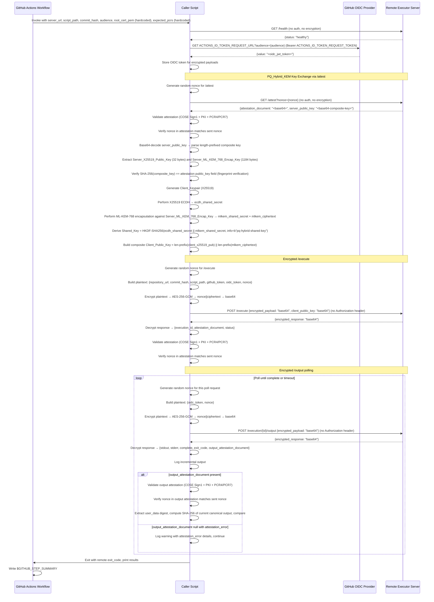
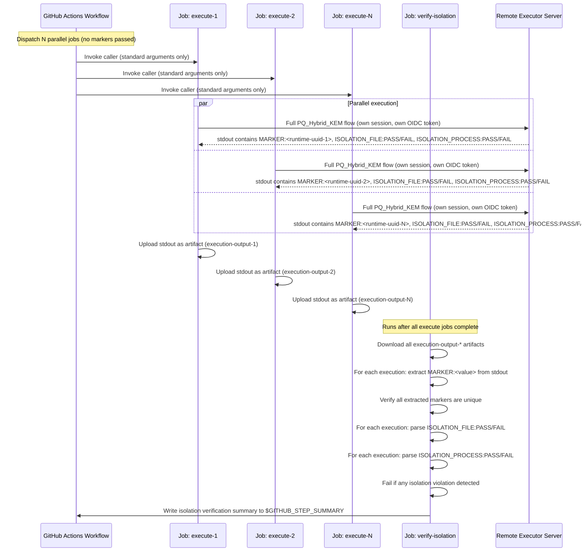

# Design Document: GitHub Actions Remote Executor Caller

## Overview

The GitHub Actions Remote Executor Caller is the client-side counterpart to the Remote Executor server. It consists of a GitHub Actions workflow (`call-remote-executor.yml`) and a Python caller script (`.github/scripts/call_remote_executor.py`) that together orchestrate the full lifecycle of a remote script execution: health check, OIDC token acquisition, server attestation and composite public key retrieval, PQ_Hybrid_KEM key exchange (X25519 + ML-KEM-768), encrypted execution submission, attestation validation, encrypted output polling, output integrity verification, and result reporting.

The caller communicates with the Remote Executor server using PQ_Hybrid_KEM-based encryption for all sensitive endpoints (`/execute` and `/execution/{id}/output`). It first obtains the server's composite public key (X25519 + ML-KEM-768 encapsulation key) via the unauthenticated `/attest` endpoint (which also returns a NitroTPM attestation document for server identity verification). The composite key is returned as a separate field in the `/attest` JSON response because it exceeds the 1024-byte attestation document `public_key` field limit — the attestation document instead contains a SHA-256 fingerprint of the composite key, which the caller verifies. The caller then generates a client-side X25519 keypair, performs ML-KEM-768 encapsulation against the server's encapsulation key, and derives a shared AES-256-GCM key by combining both the X25519 ECDH shared secret and the ML-KEM-768 shared secret via HKDF-SHA256 with `info=b"pq-hybrid-shared-key"`. All request payloads (including the OIDC token) are encrypted before transmission. The OIDC token is transmitted exclusively within the encrypted payload — no `Authorization` header is used on any request.

The caller enforces a fail-closed attestation model: the execution-acceptance attestation from `/execute` is mandatory (the caller fails if the decrypted response has no `attestation_document` or it is empty), and the attested `repository_url`, `commit_hash`, and `script_path` fields from the attestation's `user_data` are compared against the values the caller sent in the execution request to ensure cryptographic binding. On the final poll response, the caller fails closed when no valid output attestation is present, unless the `--allow-missing-output-attestation` CLI flag is set for degraded operation. The `exit_code` field must be a concrete integer when `complete=true`; missing or non-integer values are treated as protocol errors.

The caller validates the server's NitroTPM attestation documents at three points: (1) when the server's composite public key is retrieved via `/attest` (including fingerprint verification), (2) when the execution request is accepted via `/execute` (mandatory, with response binding), and (3) on every poll response from `/execution/{id}/output` that contains an `output_attestation_document` (not just on completion). Each request includes a unique random nonce that is verified in the returned attestation document to ensure freshness and prevent replay attacks. When the server fails to generate an output attestation document for a poll response, it returns `output_attestation_document: null` with an `attestation_error` field; the caller logs a warning and continues polling without failing. When a poll response indicates the output was truncated (`truncated: true`), the caller logs a warning and records the truncation status for inclusion in the workflow summary.

The workflow validates the `concurrency_count` input as a strict positive integer (regex `^[1-9][0-9]*$`) before any shell use and passes it via an environment variable rather than direct shell interpolation, preventing shell injection. An optional `server_url_allowlist` input restricts which server URLs the workflow may target. Size limits are enforced on attestation documents, encrypted responses, composite server public keys, and stdout/stderr output before decoding or processing. Untrusted remote output is Markdown-escaped before being written to the GitHub Actions job summary.

The caller handles server-side rate limiting (HTTP 429 Too Many Requests) on `/health`, `/attest`, and `/execute` endpoints by retrying with exponential backoff up to a configurable number of retries. It also handles specific error responses from `/execute`: HTTP 413 (script too large), HTTP 503 (server at capacity), HTTP 400 (duplicate nonce / anti-replay), and HTTP 400 (invalid script path — absolute path or null byte rejected by server-side `validate_script_path`).

The workflow also supports concurrent execution isolation testing. When configured with a `concurrency_count` greater than 1, the workflow dispatches multiple independent caller script invocations in parallel — each with its own PQ_Hybrid_KEM session, OIDC token, and attestation validation. Each execution's build script generates its own unique marker at runtime (via `/proc/sys/kernel/random/uuid`), so no marker is passed from the workflow or included in the encrypted payload. After all executions complete, the workflow extracts the `MARKER:<value>` from each execution's stdout and verifies that all markers are unique and that each execution passes filesystem and process isolation tests, demonstrating that the Remote Executor server properly isolates concurrent executions.

### Key Design Decisions

1. **Modular Python package**: Client logic is organized as a Python package (`.github/scripts/call_remote_executor/`) with focused modules: `errors.py` (CallerError), `encryption.py` (ClientEncryption / PQ_Hybrid_KEM), `attestation.py` (COSE Sign1 / PKI / PCR validation as standalone functions), `caller.py` (RemoteExecutorCaller HTTP client with thin delegation wrappers), and `cli.py` (argparse / main entry point). The package `__init__.py` re-exports all public symbols for backward-compatible imports. A `__main__.py` enables `python .github/scripts/call_remote_executor` invocation. Attestation methods are extracted as module-level functions accepting `root_cert_pem` and `expected_pcrs` as explicit parameters; `RemoteExecutorCaller` retains thin wrapper methods that delegate to these functions, preserving the existing instance-method API.
2. **`cbor2` for CBOR decoding**: The attestation documents are COSE Sign1 structures encoded in CBOR. We use the `cbor2` library (pure Python) for decoding both the outer COSE structure and the inner attestation payload.
3. **`pycose` for COSE Sign1 verification**: The `pycose` library provides `Sign1Message` and `EC2` key types for verifying the COSE signature using the signing certificate's public key.
4. **`pyOpenSSL` for certificate chain validation**: The `OpenSSL.crypto` module provides `X509Store` and `X509StoreContext` for validating the signing certificate against the CA bundle and root certificate, matching the NitroTPM attestation verification pattern for attestable AMIs.
5. **`pycryptodome` for key parameter extraction**: The `Crypto.Util.number.long_to_bytes` utility converts the EC public key coordinates from integers to bytes for COSE key construction.
6. **`cryptography` for X25519 and AES-256-GCM**: The `cryptography` library provides X25519 key generation, ECDH key exchange, HKDF-SHA256 key derivation, and AES-256-GCM encryption/decryption — the classical components of the PQ_Hybrid_KEM encryption scheme.
7. **`wolfcrypt-py` for ML-KEM-768**: The `wolfcrypt-py` library (via `wolfcrypt.ciphers` module: `MlKemType`, `MlKemPublic`) provides ML-KEM-768 (FIPS 203) encapsulation on the client side, producing the ML-KEM-768 shared secret and ciphertext needed for the post-quantum component of the hybrid key exchange.
8. **`requests` for HTTP**: Simple synchronous HTTP client is sufficient since the caller performs sequential operations (health check → OIDC → attest → execute → poll loop).
8. **Canonical output format**: The server constructs `Script_Output` as `stdout:{stdout}\nstderr:{stderr}\nexit_code:{exit_code}`. The caller must replicate this exact format when computing the SHA-256 digest for output attestation verification.
9. **Exit code propagation**: The caller script exits with the remote script's exit code, allowing the GitHub Actions workflow to naturally fail when the remote script fails.
10. **Hardcoded trust anchors**: The NitroTPM attestation root CA certificate PEM and expected PCR4/PCR7 values are hardcoded directly in the GitHub Actions workflow YAML. This eliminates the need for users to supply these values at dispatch time, ensuring every invocation performs full cryptographic verification.
11. **OIDC token in encrypted payload**: The caller acquires a GitHub Actions OIDC token and includes it in the `oidc_token` field of the encrypted request payload for `/execute` and `/execution/{id}/output`. No `Authorization` header is sent on any request. This ensures the token is protected by PQ_Hybrid_KEM encryption in transit.
12. **Per-session PQ_Hybrid_KEM keypair**: A fresh X25519 keypair is generated and ML-KEM-768 encapsulation is performed for each execution session. The keypair and ML-KEM-768 ciphertext are held in memory only and never persisted to disk. The derived shared key is reused for all `/execution/{id}/output` requests within the same session.
13. **Mandatory nonces on all attested endpoints**: Every request to `/attest`, `/execute`, and `/execution/{id}/output` includes a unique random nonce. The caller verifies the nonce appears in the returned attestation document to ensure freshness.
14. **Matrix strategy for concurrent executions**: When `concurrency_count > 1`, the workflow uses a GitHub Actions matrix strategy to dispatch N parallel jobs. Each invocation runs as a fully independent job with its own PQ_Hybrid_KEM session, OIDC token, and attestation validation. A separate `verify-isolation` job collects all outputs, extracts `MARKER:<value>` from each stdout, and performs cross-execution isolation verification.
15. **Runtime-generated execution markers**: The sample build script generates its own unique marker at runtime using `/proc/sys/kernel/random/uuid`, rather than receiving a marker from the workflow or encrypted payload. This avoids coupling the caller to marker generation and works regardless of whether the server supports passing custom environment variables.
16. **Sample build script isolation tests**: The sample build script performs filesystem isolation (write/sleep/read at `/tmp/isolation-test.txt`) and process isolation (start a uniquely-named dummy process, verify only one is visible) tests, outputting parseable `ISOLATION_FILE:PASS/FAIL` and `ISOLATION_PROCESS:PASS/FAIL` lines.
17. **Trust-anchor-only PKI model**: Certificate chain validation constructs an X509Store containing only the pinned AWS Nitro root CA certificate as the trust anchor. All intermediate certificates from the attestation `cabundle` are passed as untrusted intermediates to path validation, not added to the trust store. This prevents a malicious server from injecting its own CA into the cabundle to forge attestations.
18. **Fail-closed attestation model**: The execution-acceptance attestation from `/execute` is mandatory — the caller fails if the decrypted response has no `attestation_document` or it is empty. The attested `repository_url`, `commit_hash`, and `script_path` fields from the attestation's `user_data` are compared against the values the caller sent in the execution request to ensure cryptographic binding. On the final poll, the caller fails closed when no valid output attestation is present, unless `--allow-missing-output-attestation` is set.
19. **Input validation and shell injection prevention**: The `concurrency_count` workflow input is validated as a strict positive integer (regex `^[1-9][0-9]*$`) before any shell use and is passed via environment variable rather than direct shell interpolation. An optional `server_url_allowlist` input restricts which server URLs the workflow may target.
20. **Size limits on protocol fields**: Maximum accepted sizes are enforced on base64-encoded attestation documents, encrypted responses, composite server public keys, and stdout/stderr output before decoding or processing, preventing resource exhaustion from oversized server-supplied blobs.
21. **Markdown escaping in summaries**: Untrusted remote output (stdout, stderr) is escaped for Markdown-sensitive characters before being written into the GitHub Actions job summary, preventing Markdown injection that could mislead reviewers.
22. **Mandatory attestation parameters**: `root_cert_pem` and `expected_pcrs` are required parameters on `RemoteExecutorCaller` with no default values. An error is raised if attestation operations are attempted without a configured trust anchor and PCR policy, preventing accidental insecure use.
23. **Exit code validation**: When `complete=true`, the `exit_code` field must be a concrete integer. Missing or non-integer values are treated as protocol errors, preventing a malformed server response from converting an invalid terminal state into an apparently successful workflow run.

## Architecture

### Single Execution Flow



### Concurrent Execution Flow (concurrency_count > 1)



### Component Layout

```
.github/
  workflows/
    call-remote-executor.yml        # workflow_dispatch workflow
  scripts/
    call_remote_executor/           # Python package (caller script)
      __init__.py                   # Re-exports: CallerError, ClientEncryption, RemoteExecutorCaller,
                                    #              AttestationArtifactCollector, EXPECTED_ATTESTATION_FIELDS, main
      __main__.py                   # Entry point: from .cli import main; main()
      errors.py                     # CallerError exception class
      encryption.py                 # ClientEncryption class (PQ_Hybrid_KEM client-side)
      attestation.py                # EXPECTED_ATTESTATION_FIELDS, decode_cose_sign1(),
                                    # validate_attestation(), verify_certificate_chain(),
                                    # verify_cose_signature(), validate_pcrs(), verify_nonce(),
                                    # validate_output_attestation()
      artifact.py                   # AttestationArtifactCollector class (attestation document
                                    # persistence, manifest generation)
      caller.py                     # RemoteExecutorCaller class (HTTP client, orchestration)
      cli.py                        # main() function, argparse setup
    verify_isolation.py             # Isolation verification script
    pyproject.toml                  # caller dependencies
scripts/
  sample-build.sh                   # sample build script for remote execution
```

## Components and Interfaces

### 1. GitHub Actions Workflow (`call-remote-executor.yml`)

Responsibilities:
- Define `workflow_dispatch` inputs: `server_url` (required), `script_path` (optional, default `scripts/sample-build.sh`), `commit_hash` (optional, default `${{ github.sha }}`), `audience` (optional, specifies the OIDC audience value), `concurrency_count` (optional, default `1`, number of parallel executions), `server_url_allowlist` (optional, comma-separated list of permitted server URLs)
- Validate the `concurrency_count` input as a strict positive integer (matching regex `^[1-9][0-9]*$`) before any shell use, and fail with a clear error message if the value does not match
- Pass the `concurrency_count` input through an environment variable rather than interpolating it directly into shell code, to prevent shell injection
- When `server_url_allowlist` is configured, reject any `server_url` not present in the allowlist before proceeding
- Declare `id-token: write` in the `permissions` block to enable OIDC token requests
- Hardcode the NitroTPM attestation root CA certificate PEM inline in the workflow YAML as an environment variable, and pass it to the caller script via `--root-cert-pem`
- Hardcode the expected PCR4 and PCR7 values as a JSON map inline in the workflow YAML, and pass it to the caller script via `--expected-pcrs`
- Pass the `audience` input to the caller script via `--audience`
- Validate that `server_url` is not empty
- Check out the repository
- Install Python dependencies from `.github/scripts/pyproject.toml`
- When `concurrency_count == 1`: invoke the caller script directly in a single job (existing behavior)
- When `concurrency_count > 1`: use a matrix strategy to dispatch N parallel `execute` jobs, followed by a `verify-isolation` job that collects and verifies all outputs
- After the caller script completes (regardless of success or failure), upload the attestation output directory as a GitHub Actions artifact using `actions/upload-artifact`. Name the artifact `attestation-documents` for single execution mode, or `attestation-documents-{index}` for concurrent execution mode. Use `if: always()` to ensure upload even on failure, and `if-no-files-found: ignore` to skip gracefully if no documents were collected.

#### Concurrent Execution Workflow Structure

When `concurrency_count > 1`, the workflow uses a two-phase job structure:

**Phase 1: `execute` job (matrix strategy)**
- Matrix dimension: `index: [1, 2, ..., concurrency_count]`
- Each matrix job:
  1. Checks out the repository
  2. Installs Python dependencies
  3. Invokes the caller script with all standard arguments (no `--execution-marker`)
  4. Saves the stdout output to a file
  5. Uploads the output file as a GitHub Actions artifact (`execution-output-{index}`)

**Phase 2: `verify-isolation` job (depends on all `execute` jobs)**
- Downloads all `execution-output-*` artifacts
- For each execution output:
  1. Extracts the `MARKER:<value>` line from stdout
  2. Parses `ISOLATION_FILE:PASS` or `ISOLATION_FILE:FAIL` line
  3. Parses `ISOLATION_PROCESS:PASS` or `ISOLATION_PROCESS:FAIL` line
- Verifies all extracted markers are unique across all executions (duplicate markers indicate broken isolation since each build script generates its own UUID independently)
- Fails the workflow if any isolation violation is detected (duplicate markers, `ISOLATION_FILE:FAIL`, or `ISOLATION_PROCESS:FAIL`)
- Logs a warning if any isolation test result line is missing from the output
- Writes a comprehensive isolation verification summary to `$GITHUB_STEP_SUMMARY` including per-execution results

### 2. Caller Script (`.github/scripts/call_remote_executor/`)

The caller is organized as a Python package with focused modules. The `__init__.py` re-exports all public symbols so that `from call_remote_executor import CallerError, ClientEncryption, RemoteExecutorCaller, EXPECTED_ATTESTATION_FIELDS` continues to work. A `__main__.py` enables `python .github/scripts/call_remote_executor` invocation.

#### Module: `errors.py`

Contains only `CallerError` — the leaf dependency with no intra-package imports.

#### Module: `encryption.py`

Contains `ClientEncryption`. Imports `CallerError` from `errors.py`. External deps: `hashlib`, `json`, `os`, `struct`, `base64`, `cryptography` (X25519, HKDF, AESGCM), `wolfcrypt` (MlKemType, MlKemPublic).

#### Module: `attestation.py`

Contains attestation validation as module-level functions (not instance methods). Each function accepts `root_cert_pem` and/or `expected_pcrs` as explicit parameters:

- `EXPECTED_ATTESTATION_FIELDS` constant
- `decode_cose_sign1(raw_bytes, phase) -> list`
- `validate_attestation(attestation_b64, root_cert_pem, expected_pcrs, expected_nonce=None) -> dict`
- `verify_certificate_chain(cert_der, cabundle, root_cert_pem) -> None`
- `verify_cose_signature(cose_array, root_cert_pem) -> None`
- `validate_pcrs(document_pcrs, expected_pcrs) -> None`
- `verify_nonce(payload_doc, expected_nonce, phase) -> None`
- `validate_output_attestation(output_attestation_b64, stdout, stderr, exit_code, root_cert_pem, expected_pcrs, expected_nonce=None) -> bool`

Imports `CallerError` from `errors.py`. External deps: `base64`, `hashlib`, `logging`, `cbor2`, `pycose`, `OpenSSL.crypto`, `Crypto.Util.number`, `cryptography.x509`.

#### Module: `artifact.py`

Contains `AttestationArtifactCollector` — responsible for saving attestation documents and their corresponding attested payloads to disk, and generating the JSON manifest. Imports `CallerError` from `errors.py`. External deps: `json`, `os`, `pathlib`, `datetime`.

#### Module: `caller.py`

Contains `RemoteExecutorCaller`. Imports from `errors.py`, `encryption.py`, and `attestation` module. Retains thin delegation methods that preserve the existing instance-method API:

- `validate_attestation(self, attestation_b64, expected_nonce=None)` → calls `attestation.validate_attestation(attestation_b64, self.root_cert_pem, self.expected_pcrs, expected_nonce)`
- `validate_output_attestation(self, ...)` → calls `attestation.validate_output_attestation(..., self.root_cert_pem, self.expected_pcrs, ...)`
- `_decode_cose_sign1(self, raw_bytes, phase)` → calls `attestation.decode_cose_sign1(raw_bytes, phase)`
- `_verify_certificate_chain(self, cert_der, cabundle)` → calls `attestation.verify_certificate_chain(cert_der, cabundle, self.root_cert_pem)`
- `_verify_cose_signature(self, cose_array)` → calls `attestation.verify_cose_signature(cose_array, self.root_cert_pem)`
- `_validate_pcrs(self, document_pcrs)` → calls `attestation.validate_pcrs(document_pcrs, self.expected_pcrs)`
- `_verify_nonce(self, payload_doc, expected_nonce, phase)` → calls `attestation.verify_nonce(payload_doc, expected_nonce, phase)`

External deps: `base64`, `json`, `logging`, `os`, `time`, `requests`.

#### Module: `cli.py`

Contains `main()` — argparse setup, env var reading, `RemoteExecutorCaller` construction, `run()` invocation, error handling, `GITHUB_STEP_SUMMARY` writing. Imports `CallerError` from `errors.py` and `RemoteExecutorCaller` from `caller.py`. Accepts `--attestation-output-dir` argument (optional, default `attestation-documents`), `--allow-missing-output-attestation` flag (optional, default off — enables degraded operation when output attestation is absent), and `--max-output-size` argument (optional, maximum accepted size in bytes for stdout/stderr). Passes all to `RemoteExecutorCaller.__init__`.

#### Import Dependency Graph (call_remote_executor)

```
cli.py → caller.py → attestation.py → errors.py
                    → encryption.py  → errors.py
                    → artifact.py    → errors.py
       → errors.py
```

All dependencies are acyclic. `errors.py` is the leaf.

The class interfaces remain unchanged:

```python
class ClientEncryption:
    """PQ_Hybrid_KEM encryption helper for the caller side.
    
    Generates a client X25519 keypair, performs ML-KEM-768 encapsulation
    against the server's encapsulation key, derives a shared AES-256-GCM key
    by combining both shared secrets via HKDF-SHA256, and provides
    encrypt/decrypt methods for request/response payloads.
    """

    def __init__(self):
        """Generate a fresh X25519 keypair for this session."""

    @property
    def client_public_key_bytes(self) -> bytes:
        """Return the composite client public key as length-prefixed concatenation
        of the 32-byte X25519 public key + 1088-byte ML-KEM-768 ciphertext.
        Each component is preceded by a 4-byte big-endian length prefix.
        
        Must be called after derive_shared_key (which performs ML-KEM-768 encapsulation).
        """

    @staticmethod
    def parse_composite_server_key(composite_key_bytes: bytes) -> tuple[bytes, bytes]:
        """Parse a length-prefixed composite server public key.
        
        Returns (x25519_public_key_bytes, mlkem768_encap_key_bytes).
        Raises CallerError if the format is invalid or component sizes are wrong.
        """

    @staticmethod
    def verify_server_key_fingerprint(composite_key_bytes: bytes, expected_fingerprint: bytes) -> None:
        """Verify that SHA-256(composite_key_bytes) matches the expected fingerprint.
        
        Raises CallerError if the fingerprint does not match.
        """

    def derive_shared_key(self, server_composite_key_bytes: bytes) -> None:
        """
        Derive the Shared_Key via PQ_Hybrid_KEM:
        1. Parse composite server key to extract X25519 public key and ML-KEM-768 encapsulation key
        2. Perform X25519 ECDH → ecdh_shared_secret
        3. Perform ML-KEM-768 encapsulation against server's encapsulation key → mlkem_shared_secret + mlkem_ciphertext
        4. Combine: HKDF-SHA256(ecdh_shared_secret || mlkem_shared_secret, salt=None, info=b"pq-hybrid-shared-key", length=32)
        
        Stores the derived key for use by encrypt_payload/decrypt_response.
        Stores the ML-KEM-768 ciphertext for inclusion in client_public_key_bytes.
        
        Raises CallerError if server key is invalid or ML-KEM-768 encapsulation fails.
        """

    def encrypt_payload(self, payload_dict: dict) -> str:
        """
        Serialize payload_dict to JSON, encrypt with AES-256-GCM using Shared_Key.
        
        Returns base64-encoded string of (12-byte random nonce || ciphertext).
        Raises CallerError if Shared_Key has not been derived yet.
        """

    def decrypt_response(self, encrypted_response_b64: str) -> dict:
        """
        Base64-decode, split into 12-byte nonce + ciphertext, decrypt with AES-256-GCM.
        
        Returns the deserialized JSON dict.
        Raises CallerError on decryption failure or invalid JSON.
        """
```

```python
class RemoteExecutorCaller:
    def __init__(self, server_url: str, timeout: int = 30,
                 poll_interval: int = 5, max_poll_duration: int = 600,
                 max_retries: int = 3,
                 root_cert_pem: str,
                 expected_pcrs: dict[int, str],
                 audience: str = "",
                 attestation_output_dir: str | None = None,
                 allow_missing_output_attestation: bool = False,
                 max_output_size: int | None = None):
        """
        Initialize caller with server URL and configuration.
        
        Args:
            root_cert_pem: PEM-encoded AWS Nitro root CA certificate string.
                           Hardcoded in the workflow and always provided.
                           REQUIRED — raises error if empty or not provided.
            expected_pcrs: Dict mapping PCR index (int) to expected hex value (str).
                           Hardcoded in the workflow for PCR4 and PCR7.
                           REQUIRED — raises error if None or empty.
            audience: Audience value for OIDC token request. Must match the
                      Remote Executor server's expected audience configuration.
            attestation_output_dir: Optional directory path for saving attestation
                                    documents and payloads as artifacts. When provided,
                                    creates an AttestationArtifactCollector that persists
                                    all attestation documents received during the session.
            allow_missing_output_attestation: When True, permits the run to continue
                                              when output attestation is absent or invalid
                                              on the final poll, logging a warning instead
                                              of failing. Default False (fail-closed).
            max_output_size: Optional maximum accepted size in bytes for stdout and
                             stderr received from the server. Oversized output is
                             truncated before logging, summarizing, or persisting.
        """

    @staticmethod
    def generate_nonce() -> str:
        """
        Generate a unique random nonce string for attestation freshness verification.
        
        Returns a hex-encoded random string (e.g., 32 random bytes → 64 hex chars).
        Each call produces a unique value.
        """

    def request_oidc_token(self) -> str:
        """
        Request an OIDC token from GitHub's OIDC provider.
        
        Reads ACTIONS_ID_TOKEN_REQUEST_URL and ACTIONS_ID_TOKEN_REQUEST_TOKEN
        from environment variables. Makes an HTTP GET to the request URL with:
        - Header: Authorization: Bearer {ACTIONS_ID_TOKEN_REQUEST_TOKEN}
        - Query parameter: audience={self.audience}
        
        Extracts the JWT token from the response JSON 'value' field.
        Stores the token on self._oidc_token for use in encrypted payloads.
        
        Returns the OIDC JWT token string.
        Raises CallerError(phase="oidc") if env vars are missing or request fails.
        """

    def health_check(self) -> dict:
        """
        GET /health - verify server is healthy.
        Does NOT include Authorization header or any authentication.
        Returns parsed JSON response (expected: {"status": "healthy"}).
        If the server returns HTTP 429 Too Many Requests, retries with
        exponential backoff up to max_retries before failing.
        Raises CallerError if unhealthy, rate limited beyond retries, or unreachable.
        """

    def attest(self) -> bytes:
        """
        GET /attest?nonce={nonce} - retrieve server attestation and composite public key.
        
        Does NOT include Authorization header or any authentication.
        Generates a unique random nonce and includes it as a query parameter.
        Validates the returned attestation document (COSE Sign1 + PKI + PCR).
        Verifies the nonce in the attestation matches the sent nonce.
        Extracts the composite Server_Public_Key from the `server_public_key` field in the JSON response.
        Verifies the SHA-256 fingerprint of the composite key matches the `public_key` field in the attestation document.
        Parses the composite key to extract X25519 public key and ML-KEM-768 encapsulation key.
        
        Initializes self._encryption (ClientEncryption) and derives the Shared_Key via PQ_Hybrid_KEM.
        
        Returns the raw composite server public key bytes.
        Raises CallerError on validation failure, fingerprint mismatch, missing public_key, rate limit exceeded, or connection error.
        """

    def execute(self, repository_url: str, commit_hash: str,
                script_path: str, github_token: str) -> dict:
        """
        POST /execute - submit encrypted execution request.
        
        Builds plaintext payload: {repository_url, commit_hash, script_path,
        github_token, oidc_token, nonce}.
        Encrypts with Shared_Key via ClientEncryption.
        Sends JSON body: {encrypted_payload: "base64", client_public_key: "base64"}.
        The client_public_key is the composite key (length-prefixed X25519 pub + ML-KEM-768 ciphertext).
        No Authorization header.
        
        Decrypts the encrypted response to extract execution_id and attestation_document.
        
        MANDATORY ATTESTATION: Fails if the decrypted response has no
        `attestation_document` field or the field is empty.
        
        RESPONSE BINDING: After validating the attestation, parses the attested
        payload and compares the attested `repository_url`, `commit_hash`, and
        `script_path` fields from the attestation's `user_data` against the values
        the caller sent in the execution request. Fails if any attested field does
        not match the sent request values.
        
        Handles specific HTTP error responses:
        - HTTP 413: Script file exceeds server's MAX_SCRIPT_SIZE_BYTES
        - HTTP 503: Server at maximum concurrent execution capacity
        - HTTP 400 (duplicate nonce): Anti-replay rejection
        - HTTP 400 (invalid script path): script_path is absolute or contains null bytes
        - HTTP 429: Rate limited — retries with exponential backoff up to max retries
        Validates the attestation and verifies the nonce matches.
        
        Returns parsed decrypted response dict.
        Raises CallerError on HTTP errors, encryption/decryption failures,
        missing attestation, response binding mismatch, or attestation failures.
        """

    def validate_attestation(self, attestation_b64: str, expected_nonce: str | None = None) -> dict:
        """
        Full attestation verification:
        1. Decode base64 → binary → CBOR → COSE Sign1 array [phdr, uhdr, payload, sig]
        2. CBOR-decode payload to extract attestation fields
        3. Validate structural fields (module_id, digest, timestamp, pcrs, certificate, cabundle)
        4. Validate certificate chain (PKI) against hardcoded root cert
        5. Verify COSE Sign1 signature using signing certificate's EC2 public key (P-384/ES384)
        6. Validate PCR4 and PCR7 values against hardcoded expected values
        7. If expected_nonce is provided, verify the nonce field in the attestation matches
        Returns parsed attestation payload dict.
        Raises CallerError on any verification failure.
        """

    def _verify_certificate_chain(self, cert_der: bytes, cabundle: list[bytes]) -> None:
        """
        Validate the signing certificate against the CA bundle and root certificate.
        Constructs an X509Store with ONLY the pinned root_cert_pem as the trust anchor.
        Passes all intermediate certificates from cabundle as untrusted intermediates
        to path validation, rather than adding them to the trust store. This prevents
        a malicious server from injecting its own CA into the cabundle to forge attestations.
        Raises CallerError if certificate chain validation fails.
        """

    def _verify_cose_signature(self, cose_array: list) -> None:
        """
        Verify the COSE Sign1 signature using the signing certificate's public key.
        Extracts EC2 key parameters (x, y on P-384) from the certificate.
        Constructs a Sign1Message and verifies the signature with ES384.
        Raises CallerError if signature verification fails.
        """

    def _validate_pcrs(self, document_pcrs: dict) -> None:
        """
        Compare expected PCR values (PCR4 and PCR7) against those in the attestation document.
        Raises CallerError if any expected PCR is missing or mismatched.
        """

    def _verify_nonce(self, payload_doc: dict, expected_nonce: str, phase: str) -> None:
        """
        Verify the nonce field in the attestation payload matches the expected nonce.
        Raises CallerError if the nonce is missing or does not match.
        """

    def poll_output(self, execution_id: str) -> dict:
        """
        Poll POST /execution/{id}/output until complete or timeout.
        
        Each poll request:
        - Generates a unique random nonce
        - Builds plaintext: {oidc_token, nonce}
        - Encrypts with Shared_Key via ClientEncryption
        - Sends JSON body: {encrypted_payload: "base64"} (no client_public_key)
        - No Authorization header
        - Decrypts the encrypted response
        
        On every poll response that contains an output_attestation_document:
        - Validates the output attestation (COSE Sign1 + PKI + PCR4/PCR7)
        - Verifies the nonce in the output_attestation_document matches the nonce sent in that request
        - Computes SHA-256 of the current canonical output and compares against the user_data digest
        
        When output_attestation_document is null and an attestation_error field is present,
        logs a warning with the error details and continues polling without failing.
        
        EXIT CODE VALIDATION: When `complete=true`, verifies that `exit_code` is a
        concrete integer. Missing or non-integer `exit_code` is treated as a protocol
        error that fails the workflow step.
        
        FAIL-CLOSED OUTPUT ATTESTATION: When `complete=true` and the final poll
        response does not contain a valid output attestation document, fails the
        workflow step with an error — unless `allow_missing_output_attestation` is
        set, in which case logs a warning and continues.
        
        OUTPUT SIZE LIMITS: Enforces configurable maximum accepted size for stdout
        and stderr. Oversized output is truncated before logging, summarizing, or
        persisting to artifacts.
        
        When the decrypted response contains `truncated: true`, logs a warning indicating
        the server output was truncated due to exceeding the maximum output size, and records
        the truncation status for inclusion in the workflow result reporting.
        
        Logs incremental output during polling.
        Returns final decrypted response with stdout, stderr, exit_code,
        output_attestation_document, and truncated status.
        Raises CallerError on timeout, repeated HTTP failures, decryption errors,
        exit_code validation failure, missing output attestation (when fail-closed),
        or output attestation validation failures.
        """

    def validate_output_attestation(self, output_attestation_b64: str,
                                     stdout: str, stderr: str,
                                     exit_code: int,
                                     expected_nonce: str | None = None) -> bool:
        """
        Full output attestation verification:
        1. Decode base64 → COSE Sign1 → attestation payload (same as validate_attestation)
        2. Validate certificate chain (PKI) against hardcoded root cert
        3. Verify COSE Sign1 signature
        4. Validate PCR4 and PCR7 values against hardcoded expected values
        5. If expected_nonce provided, verify nonce in attestation matches
        6. Extract user_data from verified payload (SHA-256 hex digest)
        7. Compute SHA-256 of canonical output format
        8. Compare digests
        Returns True if match. Raises CallerError on any failure.
        """

    def run(self, repository_url: str, commit_hash: str,
            script_path: str, github_token: str) -> int:
        """
        Orchestrate full flow:
        health_check → request_oidc_token → attest (get composite server public key, verify fingerprint, PQ_Hybrid_KEM key exchange)
        → execute (encrypted, mandatory attestation with response binding)
        → poll_output (encrypted, with per-poll output attestation validation,
          exit_code validation, fail-closed output attestation on final poll,
          output size limits)
        → finalize attestation artifacts → report results (with Markdown escaping
          and truncation status if applicable).
        
        At each attestation point, saves the attestation document and its corresponding
        attested payload via AttestationArtifactCollector (if attestation_output_dir is configured).
        
        Output attestation validation (COSE Sign1 + PKI + PCR + nonce + digest comparison)
        is performed inside poll_output on each poll response that contains an
        output_attestation_document, not as a separate step after polling.
        Returns remote script exit code.
        """
```

```python
class CallerError(Exception):
    """Raised when the caller encounters a fatal error."""
    def __init__(self, message: str, phase: str, details: dict | None = None):
        self.message = message
        self.phase = phase  # "health_check", "execute", "attestation", "polling",
                            # "output_attestation", "oidc", "attest", "encryption",
                            # "key_exchange", "artifact"
        self.details = details or {}
```

```python
class AttestationArtifactCollector:
    """Collects attestation documents and their attested payloads during an execution
    session, saves them to disk as files, and generates a JSON manifest.
    
    Each attestation document is saved as a .b64 file (raw base64 string as received
    from the server). Each attested payload is saved as a .payload.json file containing
    the data the attestation document cryptographically covers.
    
    File naming convention:
    - server-identity.b64 / server-identity.payload.json
    - execution-acceptance.b64 / execution-acceptance.payload.json
    - output-integrity-poll-001.b64 / output-integrity-poll-001.payload.json
    - output-integrity-poll-002.b64 / output-integrity-poll-002.payload.json
    - manifest.json
    """

    def __init__(self, output_dir: str):
        """
        Initialize the collector with the output directory path.
        Creates the directory (including parents) if it does not exist.
        
        Args:
            output_dir: Path to the directory where attestation artifacts will be saved.
        """

    def save_server_identity(self, attestation_b64: str, nonce: str,
                              server_public_key_b64: str,
                              server_public_key_fingerprint_hex: str) -> None:
        """
        Save the server identity attestation document and its attested payload.
        
        Saves:
        - server-identity.b64: The raw base64-encoded attestation document
        - server-identity.payload.json: {server_public_key, server_public_key_fingerprint}
        
        Records the entry in the internal manifest list.
        """

    def save_execution_acceptance(self, attestation_b64: str, nonce: str,
                                   execution_id: str, status: str) -> None:
        """
        Save the execution acceptance attestation document and its attested payload.
        
        Saves:
        - execution-acceptance.b64: The raw base64-encoded attestation document
        - execution-acceptance.payload.json: {execution_id, status}
        
        Records the entry in the internal manifest list.
        """

    def save_output_integrity(self, attestation_b64: str, nonce: str,
                               execution_id: str,
                               stdout: str, stderr: str, exit_code: int | None,
                               output_digest: str) -> None:
        """
        Save an output integrity attestation document and its attested payload.
        
        Increments the internal poll counter and saves:
        - output-integrity-poll-NNN.b64: The raw base64-encoded attestation document
        - output-integrity-poll-NNN.payload.json: {stdout, stderr, exit_code, output_digest}
        
        NNN is zero-padded to 3 digits (e.g., 001, 002, ...).
        Records the entry in the internal manifest list.
        """

    def write_manifest(self, server_url: str, execution_id: str | None,
                        start_time: str, end_time: str) -> None:
        """
        Write the manifest.json file summarizing all saved attestation documents.
        
        The manifest contains:
        - session: {server_url, execution_id, start_time, end_time}
        - documents: [{phase, attestation_filename, payload_filename, timestamp, nonce, execution_id}, ...]
        
        All timestamps are ISO 8601 UTC format.
        """

    @property
    def has_documents(self) -> bool:
        """Return True if at least one attestation document has been saved."""
```

### 3. Sample Build Script (`scripts/sample-build.sh`)

```bash
#!/usr/bin/env bash
set -euo pipefail
echo "=== Remote Executor Sample Build ==="
echo "Hostname: $(hostname)"
echo "Date: $(date -u)"
echo "Kernel: $(uname -r)"
echo "User: $(whoami)"
echo "Working directory: $(pwd)"

# --- Execution Marker (generated at runtime) ---
EXECUTION_MARKER=$(cat /proc/sys/kernel/random/uuid)
echo "MARKER:${EXECUTION_MARKER}"

# --- Filesystem Isolation Test ---
ISOLATION_FILE="/tmp/isolation-test.txt"
RANDOM_VALUE=$(cat /proc/sys/kernel/random/uuid)
echo "$RANDOM_VALUE" > "$ISOLATION_FILE"
sleep 2
READ_VALUE=$(cat "$ISOLATION_FILE")
if [ "$READ_VALUE" = "$RANDOM_VALUE" ]; then
    echo "ISOLATION_FILE:PASS"
else
    echo "ISOLATION_FILE:FAIL"
fi

# --- Process Isolation Test ---
PROC_NAME="isolation-probe-${EXECUTION_MARKER}"
# Start a uniquely-named dummy background process
bash -c "exec -a $PROC_NAME sleep 300" &
DUMMY_PID=$!
sleep 1
# Count how many processes with this unique name are visible
PROC_COUNT=$(pgrep -c -f "$PROC_NAME" || true)
if [ "$PROC_COUNT" -eq 1 ]; then
    echo "ISOLATION_PROCESS:PASS"
else
    echo "ISOLATION_PROCESS:FAIL"
fi
# Cleanup dummy process
kill "$DUMMY_PID" 2>/dev/null || true
wait "$DUMMY_PID" 2>/dev/null || true

echo "=== Build Complete ==="
```

### 4. ClientEncryption Implementation Details

The `ClientEncryption` class mirrors the server's `EncryptionManager` (from `src/encryption.py`) but from the client perspective, performing PQ_Hybrid_KEM (X25519 + ML-KEM-768):

**Key Generation:**
- Uses `cryptography.hazmat.primitives.asymmetric.x25519.X25519PrivateKey.generate()` to create a fresh X25519 keypair
- ML-KEM-768 encapsulation is performed during `derive_shared_key` (not at init time)

**Composite Server Key Parsing:**
```python
import struct

def parse_composite_server_key(composite_key_bytes: bytes) -> tuple[bytes, bytes]:
    """Parse length-prefixed composite key into (x25519_pub, mlkem768_encap_key)."""
    components = []
    offset = 0
    while offset < len(composite_key_bytes):
        (length,) = struct.unpack(">I", composite_key_bytes[offset:offset+4])
        offset += 4
        components.append(composite_key_bytes[offset:offset+length])
        offset += length
    # components[0] = 32-byte X25519 public key
    # components[1] = 1184-byte ML-KEM-768 encapsulation key
    return components[0], components[1]
```

**Server Key Fingerprint Verification:**
```python
import hashlib

fingerprint = hashlib.sha256(composite_key_bytes).digest()
assert fingerprint == attestation_public_key_field  # from attestation document
```

**Key Derivation (must match server exactly):**
```python
from cryptography.hazmat.primitives.asymmetric.x25519 import X25519PrivateKey, X25519PublicKey
from cryptography.hazmat.primitives.kdf.hkdf import HKDF
from cryptography.hazmat.primitives.hashes import SHA256
from cryptography.hazmat.primitives.ciphers.aead import AESGCM
from wolfcrypt.ciphers import MlKemType, MlKemPublic

# Parse composite server key
server_x25519_pub_bytes, server_mlkem_encap_key_bytes = parse_composite_server_key(server_composite_key)

# X25519 ECDH shared secret
server_x25519_pub = X25519PublicKey.from_public_bytes(server_x25519_pub_bytes)
ecdh_shared_secret = client_private_key.exchange(server_x25519_pub)

# ML-KEM-768 encapsulation (client side)
mlkem_pub = MlKemPublic(MlKemType.ML_KEM_768)
mlkem_pub.decode_key(server_mlkem_encap_key_bytes)
mlkem_shared_secret, mlkem_ciphertext = mlkem_pub.encapsulate()

# Combine both shared secrets via HKDF-SHA256 (must match server: salt=None, info=b"pq-hybrid-shared-key", length=32)
combined_secret = ecdh_shared_secret + mlkem_shared_secret
shared_key = HKDF(
    algorithm=SHA256(),
    length=32,
    salt=None,
    info=b"pq-hybrid-shared-key",
).derive(combined_secret)
```

**Composite Client Public Key (sent to server):**
```python
import struct

# Length-prefixed concatenation of client X25519 pub + ML-KEM-768 ciphertext
client_x25519_pub = client_private_key.public_key().public_bytes(Encoding.Raw, PublicFormat.Raw)  # 32 bytes
# mlkem_ciphertext is 1088 bytes (from encapsulation above)
client_public_key = (
    struct.pack(">I", len(client_x25519_pub)) + client_x25519_pub
    + struct.pack(">I", len(mlkem_ciphertext)) + mlkem_ciphertext
)
```

**Encryption (request payloads):**
```python
plaintext = json.dumps(payload_dict).encode("utf-8")
nonce = os.urandom(12)  # 12-byte random nonce for AES-GCM
ciphertext = AESGCM(shared_key).encrypt(nonce, plaintext, None)
wire_bytes = nonce + ciphertext  # nonce (12 bytes) || ciphertext
encrypted_payload_b64 = base64.b64encode(wire_bytes).decode("ascii")
```

**Decryption (response payloads):**
```python
wire_bytes = base64.b64decode(encrypted_response_b64)
nonce = wire_bytes[:12]
ciphertext = wire_bytes[12:]
plaintext = AESGCM(shared_key).decrypt(nonce, ciphertext, None)
response_dict = json.loads(plaintext.decode("utf-8"))
```

### 5. Attestation Validation Logic (`attestation.py`)

The attestation validation functions are module-level functions in `call_remote_executor/attestation.py`. They accept `root_cert_pem` and `expected_pcrs` as explicit parameters rather than reading from `self`. `RemoteExecutorCaller` in `caller.py` retains thin wrapper methods that delegate to these functions.

The attestation document is a COSE Sign1 structure. When base64-decoded and CBOR-decoded, it yields a 4-element array:

```python
# Outer COSE Sign1 structure (after first CBOR decode)
cose_array = cbor2.loads(raw_bytes)
# cose_array[0] = protected header (CBOR-encoded bytes)
# cose_array[1] = unprotected header (map, typically empty)
# cose_array[2] = payload (CBOR-encoded attestation document bytes)
# cose_array[3] = signature (bytes)
```

The payload (index 2) is itself CBOR-encoded and contains the attestation fields:

```python
EXPECTED_ATTESTATION_FIELDS = [
    "module_id",    # Identifier of the attestation module
    "digest",       # Digest algorithm used (e.g. "SHA384")
    "timestamp",    # When attestation was generated (Unix epoch ms)
    "pcrs",         # Platform Configuration Registers {index: bytes}
    "certificate",  # DER-encoded signing certificate (bytes)
    "cabundle",     # Certificate authority bundle (list[bytes])
]
```

Validation steps for server identity attestation (`validate_attestation`):

**Step 1: COSE Sign1 Parsing**
1. Base64-decode the `attestation_document` string to raw bytes
2. CBOR-decode the raw bytes — result must be a list/array of exactly 4 elements
3. CBOR-decode element at index 2 (payload) to get the attestation fields dict
4. Verify all `EXPECTED_ATTESTATION_FIELDS` are present as keys in the payload dict

**Step 2: Certificate Chain (PKI) Validation**
1. Create an `OpenSSL.crypto.X509Store`
2. Load the `root_cert_pem` as a PEM certificate and add to the store as the ONLY trust anchor
3. Load each certificate in `cabundle` (all entries) as DER certificates into a list of untrusted intermediates — do NOT add them to the X509Store
4. Load the `certificate` field from the payload as a DER certificate (the signing certificate)
5. Create an `X509StoreContext` with the store, the signing certificate, and the untrusted intermediate chain
6. Call `verify_certificate()` — raises on failure
7. This ensures only the pinned root is trusted; a malicious server cannot inject its own CA via the cabundle

**Step 3: COSE Signature Verification**
1. Load the signing certificate and extract its public key's `public_numbers()` (x, y coordinates)
2. Convert x and y from integers to bytes using `long_to_bytes`
3. Construct a `pycose.EC2` key with `alg=ES384`, `crv=P_384`, and the x/y bytes
4. CBOR-decode the protected header from `cose_array[0]`
5. Construct a `pycose.Sign1Message` with `phdr`, `uhdr=cose_array[1]`, `payload=cose_array[2]`
6. Set `msg.signature = cose_array[3]`
7. Call `msg.verify_signature(key)` — raise CallerError if it returns False

**Step 4: PCR Validation**
1. For each `(index, expected_hex)` in `expected_pcrs` (PCR4 and PCR7):
   - Verify the index exists in the payload's `pcrs` dict and is not None
   - Convert the document PCR bytes to hex: `document_pcrs[index].hex()`
   - Compare against `expected_hex` — raise CallerError on mismatch

**Step 5: Nonce Verification**
1. If `expected_nonce` is provided:
   - Extract the `nonce` field from the attestation payload
   - Decode from bytes to string if necessary
   - Compare against `expected_nonce` — raise CallerError on mismatch or if nonce is missing

**Step 6: Audit Logging**
1. Log attestation field values for audit trail
2. Return the parsed payload dict

Validation steps for output integrity attestation (`validate_output_attestation`):
1. Perform Steps 1–5 above on the output attestation document (same COSE Sign1 verification + nonce check)
2. Extract the `user_data` field from the verified payload (CBOR-decoded, then `.decode()` to string — contains SHA-256 hex digest)
3. Reconstruct the canonical `Script_Output`: `stdout:{stdout}\nstderr:{stderr}\nexit_code:{exit_code}`
4. Compute SHA-256 hex digest of the canonical output
5. Compare computed digest against `user_data` digest
6. Return True if they match, raise CallerError if they don't

## Data Models

### Workflow Dispatch Inputs

| Input | Type | Required | Default | Description |
|-------|------|----------|---------|-------------|
| `server_url` | string | yes | — | Base URL of the Remote Executor server |
| `script_path` | string | no | `scripts/sample-build.sh` | Path to script in the repository |
| `commit_hash` | string | no | `${{ github.sha }}` | Git commit SHA to execute |
| `audience` | string | no | — | Audience value for OIDC token request, must match server's expected audience |
| `concurrency_count` | string | no | `1` | Number of parallel execution requests to dispatch for isolation testing. Validated as strict positive integer (`^[1-9][0-9]*$`) before shell use; passed via environment variable |
| `server_url_allowlist` | string | no | — | Comma-separated list of permitted server URLs. When configured, `server_url` must be present in this list or the workflow fails |

### Workflow Permissions

| Permission | Value | Description |
|------------|-------|-------------|
| `id-token` | `write` | Required to request OIDC tokens from GitHub's OIDC provider |

### Hardcoded Workflow Constants

The following values are hardcoded inline in the workflow YAML definition (not user inputs):

| Constant | Description |
|----------|-------------|
| `ROOT_CERT_PEM` | NitroTPM attestation root CA certificate in PEM format, embedded as a multi-line string in the workflow env |
| `EXPECTED_PCRS` | JSON map `{"4": "<hex>", "7": "<hex>"}` containing expected PCR4 and PCR7 values for the attestable AMI |

### API Request/Response Shapes

**GET /health request:**
- No request body, no Authorization header

**GET /health response:**
```json
{
  "status": "healthy"
}
```

**GET /health error responses:**

| HTTP Status | Meaning | Caller Behavior |
|-------------|---------|-----------------|
| 429 | Too Many Requests (rate limited) | Retry with exponential backoff up to max retries, then fail |
| Non-200 (other) | Server unhealthy or error | Fail with server health error |

**GET /attest?nonce={nonce} request:**
- No request body, no Authorization header
- Query parameter: `nonce` (random hex string for freshness verification)

**GET /attest error responses:**

| HTTP Status | Meaning | Caller Behavior |
|-------------|---------|-----------------|
| 429 | Too Many Requests (rate limited) | Retry with exponential backoff up to max retries, then fail |
| Non-200 (other) | Server error | Fail with attest error details |

**GET /attest response:**
```json
{
  "attestation_document": "<base64-encoded-cbor>",
  "server_public_key": "<base64-encoded-composite-key>"
}
```

The attestation document's payload contains the `public_key` field (SHA-256 fingerprint of the composite server public key) and the `nonce` field (the nonce sent in the query parameter). The `server_public_key` field in the JSON response body contains the full composite key (length-prefixed concatenation of 32-byte X25519 public key + 1184-byte ML-KEM-768 encapsulation key), base64-encoded. The client must verify the key by computing SHA-256 of the received composite key and comparing against the fingerprint in the attestation document's `public_key` field.

**POST /execute request (encrypted envelope):**
```json
{
  "encrypted_payload": "<base64-encoded nonce||ciphertext>",
  "client_public_key": "<base64-encoded composite client key (length-prefixed X25519 pub + ML-KEM-768 ciphertext)>"
}
```
No Authorization header.

Plaintext payload (before encryption):
```json
{
  "repository_url": "https://github.com/owner/repo",
  "commit_hash": "abc123...",
  "script_path": "scripts/sample-build.sh",
  "github_token": "ghp_...",
  "oidc_token": "<jwt_token>",
  "nonce": "<random_hex_string>"
}
```

**POST /execute error responses:**

| HTTP Status | Meaning | Caller Behavior |
|-------------|---------|-----------------|
| 400 | Bad Request (duplicate nonce / anti-replay) | Fail with duplicate nonce error |
| 400 | Bad Request (invalid script path — absolute or null byte) | Fail with invalid script path error |
| 401 | Unauthorized (invalid/missing OIDC token) | Fail with authentication failure |
| 403 | Forbidden (repo not authorized or OIDC repo claim mismatch) | Fail with authorization error |
| 413 | Payload Too Large (script exceeds MAX_SCRIPT_SIZE_BYTES) | Fail with script size limit error |
| 429 | Too Many Requests (rate limited) | Retry with exponential backoff up to max retries, then fail |
| 503 | Service Unavailable (max concurrent executions reached) | Fail with server capacity error |

**POST /execute response (encrypted):**
```json
{
  "encrypted_response": "<base64-encoded nonce||ciphertext>"
}
```

Decrypted response payload:
```json
{
  "execution_id": "uuid-v4",
  "attestation_document": "<base64-encoded-cbor>",
  "status": "queued"
}
```

**POST /execution/{id}/output request (encrypted):**
```json
{
  "encrypted_payload": "<base64-encoded nonce||ciphertext>"
}
```
No Authorization header. No `client_public_key` (server already has the shared key from the execution context).

Plaintext payload (before encryption):
```json
{
  "oidc_token": "<jwt_token>",
  "nonce": "<random_hex_string>"
}
```

**POST /execution/{id}/output response (encrypted, complete):**
```json
{
  "encrypted_response": "<base64-encoded nonce||ciphertext>"
}
```

Decrypted response payload (running — not yet complete):
```json
{
  "execution_id": "uuid-v4",
  "status": "running",
  "stdout": "partial output so far...",
  "stderr": "",
  "stdout_offset": 512,
  "stderr_offset": 0,
  "complete": false,
  "exit_code": null,
  "output_attestation_document": "<base64-encoded-cbor>",
  "truncated": false
}
```

Decrypted response payload (running — attestation generation failed):
```json
{
  "execution_id": "uuid-v4",
  "status": "running",
  "stdout": "partial output so far...",
  "stderr": "",
  "stdout_offset": 512,
  "stderr_offset": 0,
  "complete": false,
  "exit_code": null,
  "output_attestation_document": null,
  "attestation_error": "NSM device temporarily unavailable",
  "truncated": false
}
```

Decrypted response payload (completed):
```json
{
  "execution_id": "uuid-v4",
  "status": "completed",
  "stdout": "...",
  "stderr": "...",
  "stdout_offset": 2048,
  "stderr_offset": 512,
  "complete": true,
  "exit_code": 0,
  "output_attestation_document": "<base64-encoded-cbor>",
  "truncated": false
}
```

Decrypted response payload (completed — output truncated):
```json
{
  "execution_id": "uuid-v4",
  "status": "completed",
  "stdout": "...(truncated)...",
  "stderr": "...",
  "stdout_offset": 2048,
  "stderr_offset": 512,
  "complete": true,
  "exit_code": 0,
  "output_attestation_document": "<base64-encoded-cbor>",
  "truncated": true
}
```

### OIDC Token Request/Response (GitHub OIDC Provider)

**GET {ACTIONS_ID_TOKEN_REQUEST_URL}?audience={audience} request headers:**
```
Authorization: Bearer {ACTIONS_ID_TOKEN_REQUEST_TOKEN}
```

**OIDC token response:**
```json
{
  "value": "<jwt_token_string>"
}
```

### PQ_Hybrid_KEM Encryption Parameters

| Parameter | Value | Description |
|-----------|-------|-------------|
| Classical KEM | X25519 | Elliptic curve Diffie-Hellman key agreement |
| Post-quantum KEM | ML-KEM-768 (FIPS 203) | Lattice-based key encapsulation mechanism via `wolfcrypt-py` |
| Key derivation | HKDF-SHA256 | `salt=None`, `info=b"pq-hybrid-shared-key"`, `length=32`, input=`ecdh_shared_secret \|\| mlkem_shared_secret` |
| Symmetric cipher | AES-256-GCM | 256-bit key, 12-byte random nonce, authenticated encryption |
| Wire format | `nonce (12 bytes) \|\| ciphertext` | Concatenated, then base64-encoded |
| Server public key format | Length-prefixed composite | 4-byte BE length + X25519 pub (32 bytes) + 4-byte BE length + ML-KEM-768 encap key (1184 bytes) |
| Server public key attestation | SHA-256 fingerprint | Fingerprint in attestation `public_key` field; full key in `/attest` JSON `server_public_key` field |
| Client public key format | Length-prefixed composite | 4-byte BE length + X25519 pub (32 bytes) + 4-byte BE length + ML-KEM-768 ciphertext (1088 bytes) |

### COSE Sign1 Attestation Document Structure

The attestation document is a COSE Sign1 structure. After base64-decoding and the first CBOR decode, it is a 4-element array:

```python
# Outer COSE Sign1 structure
[
    protected_header,    # bytes (CBOR-encoded map, e.g. {1: -35} for ES384)
    unprotected_header,  # map (typically empty {})
    payload,             # bytes (CBOR-encoded attestation document)
    signature,           # bytes (ECDSA signature over the payload)
]
```

After CBOR-decoding the payload (index 2), the attestation document is a map with these keys:

```python
{
    "module_id": str,        # e.g. "i-0abc123-enc0abc123"
    "digest": str,           # e.g. "SHA384"
    "timestamp": int,        # Unix epoch milliseconds
    "pcrs": dict,            # {0: bytes, 1: bytes, ...} PCR values
    "certificate": bytes,    # DER-encoded signing certificate (X.509, P-384 EC key)
    "cabundle": list[bytes], # Certificate chain (DER-encoded), first entry is root CA
    "user_data": bytes | None, # For output attestation: SHA-256 hex digest (UTF-8 encoded)
    "nonce": bytes | None,   # Nonce for freshness verification (UTF-8 encoded)
    "public_key": bytes | None, # For /attest: SHA-256 fingerprint of composite server public key (32 bytes)
}
```

The signing certificate uses an EC key on the P-384 (secp384r1) curve. The COSE signature algorithm is ES384.

### Canonical Script Output Format

The server constructs the canonical output as (from `src/server.py`):
```
stdout:{stdout_value}\nstderr:{stderr_value}\nexit_code:{exit_code_value}
```

The caller must replicate this exact format for SHA-256 digest comparison.

## Correctness Properties

*A property is a characteristic or behavior that should hold true across all valid executions of a system — essentially, a formal statement about what the system should do. Properties serve as the bridge between human-readable specifications and machine-verifiable correctness guarantees.*

### Property 1: COSE Sign1 attestation decode round-trip

*For any* valid attestation payload dict (with expected structural fields including `nonce` and `public_key`), constructing a COSE Sign1 structure (wrapping the CBOR-encoded payload in a 4-element array with a protected header, empty unprotected header, and a valid test signature), CBOR-encoding the outer structure, base64-encoding the result, then passing that base64 string through `validate_attestation` (signed with a matching test key) should produce a payload dict equivalent to the original for the structural fields the validator inspects, including the `nonce` and `public_key` fields.

**Validates: Requirements 4A.1, 4A.2, 4A.3, 6A.1, 6A.2, 6A.3, 11.5**

### Property 2: Attestation structural field validation

*For any* Python dict representing a decoded attestation payload, `validate_attestation` should accept it (not raise on structural grounds) if and only if all expected structural fields (`module_id`, `digest`, `timestamp`, `pcrs`, `certificate`, `cabundle`) are present as keys.

**Validates: Requirements 4A.7**

### Property 3: Output integrity verification (per-poll)

*For any* stdout string, stderr string, and integer exit code (representing the current output at any point during polling), if an output attestation document's `user_data` field contains the SHA-256 hex digest of the canonical output `stdout:{stdout}\nstderr:{stderr}\nexit_code:{exit_code}`, then `validate_output_attestation` should return True (assuming signature verification passes). If any of stdout, stderr, or exit_code is altered after the digest was computed, `validate_output_attestation` should raise a `CallerError`. This validation applies to every poll response that contains an `output_attestation_document`, not just the final completion response.

**Validates: Requirements 5.6, 5.7, 6A.1, 6B.8, 6B.9, 6B.10, 6B.12**

### Property 4: Health check acceptance

*For any* health response JSON, `health_check` should succeed (not raise) if and only if the HTTP status is 200 and the JSON body is `{"status": "healthy"}` with no other fields required. For all other combinations of HTTP status or `status` field value, it should raise a `CallerError`.

**Validates: Requirements 8.2, 8.3**

### Property 5: Execute HTTP error propagation

*For any* HTTP error status code (4xx or 5xx), when the `/execute` endpoint returns that status, the `execute` method should raise a `CallerError` containing the status code and error details. Specifically: HTTP 413 should indicate script size exceeds server maximum, HTTP 503 should indicate server at maximum concurrent execution capacity, HTTP 400 with duplicate nonce should indicate anti-replay rejection, HTTP 400 with invalid script path should indicate the script path is absolute or contains null bytes, and HTTP 429 should trigger retry with exponential backoff before failing with a rate limit error.

**Validates: Requirements 3.10, 3.16, 3.17, 3.18, 3.19, 3.20**

### Property 6: Polling termination on completion with per-poll output attestation

*For any* sequence of encrypted poll responses where the first N decrypted responses have `complete: false` and the (N+1)th decrypted response has `complete: true`, and each response contains an `output_attestation_document`, the `poll_output` method should make exactly N+1 HTTP POST requests (each with an encrypted payload), validate the output attestation on each poll response (COSE Sign1 + PKI + PCR + nonce + digest), and return the final decrypted response containing `stdout`, `stderr`, `exit_code`, and `output_attestation_document`.

**Validates: Requirements 5.6, 5.7, 5.14**

### Property 7: Polling retry on transient errors

*For any* number of consecutive HTTP errors K where K < max_retries, followed by a successful response, `poll_output` should recover and continue polling. When K >= max_retries consecutive errors occur, `poll_output` should raise a `CallerError`.

**Validates: Requirements 5.10**

### Property 8: Exit code propagation

*For any* integer exit code returned by the remote script, the `run` method should return that same exit code, preserving the value exactly.

**Validates: Requirements 7.6**

### Property 9: Summary contains execution results

*For any* execution result (stdout, stderr, exit_code, attestation status, output integrity status, truncation status), the generated GitHub Actions job summary string should contain the stdout content, stderr content, exit code value, attestation validation result, output integrity verification result, and a truncation warning when the output was truncated by the server.

**Validates: Requirements 7.7, 7.8**

### Property 10: COSE signature verification rejects tampered payloads

*For any* valid COSE Sign1 attestation document (signed with a test EC P-384 key), if the payload bytes are modified after signing (even a single byte change), `_verify_cose_signature` should raise a `CallerError` indicating signature verification failure.

**Validates: Requirements 4C.15, 4C.16**

### Property 11: PCR validation accepts matching and rejects mismatching values

*For any* set of expected PCR values (dict of int→hex string) and a document PCR dict, `_validate_pcrs` should accept if and only if every expected PCR index exists in the document and the hex-encoded value matches exactly. Missing indices or mismatched values should raise a `CallerError`.

**Validates: Requirements 4D.17, 4D.18, 4D.19**

### Property 12: Certificate chain validation rejects untrusted certificates (trust-anchor-only model)

*For any* signing certificate not chained to the configured pinned root CA, `_verify_certificate_chain` should raise a `CallerError`. Conversely, a certificate properly chained through the cabundle to the root CA should pass validation. Critically, if a non-pinned CA is included in the `cabundle`, a signing certificate chained to that non-pinned CA should be rejected — because cabundle entries are passed as untrusted intermediates, not added to the trust store as trust anchors.

**Validates: Requirements 4B.8, 4B.9, 4B.11, 4B.12**

### Property 13: OIDC token acquisition

*For any* audience string and valid OIDC provider response containing a JWT token in the `value` field, `request_oidc_token` should make an HTTP GET to `ACTIONS_ID_TOKEN_REQUEST_URL` with the `audience` query parameter set to the configured audience and an `Authorization: Bearer {ACTIONS_ID_TOKEN_REQUEST_TOKEN}` header, and should store the returned token for reuse in subsequent encrypted payloads.

**Validates: Requirements 9.3, 9.4, 9.7**

### Property 14: OIDC token in encrypted payload, not in headers

*For any* OIDC token stored on the caller instance, `execute` and `poll_output` should include the token in the `oidc_token` field of the encrypted request payload. No HTTP request to any endpoint (`/health`, `/attest`, `/execute`, `/execution/{id}/output`) should include an `Authorization` header.

**Validates: Requirements 10.1, 10.2, 10.3, 10.4, 10.5**

### Property 15: OIDC authentication error handling

*For any* HTTP 401 or 403 response from the Remote Executor server on `/execute` or `/execution/{id}/output`, the caller should raise a `CallerError` with an appropriate error message: "authentication failure" for 401 and "repository is not authorized or OIDC repository claim does not match" for 403. For any missing `ACTIONS_ID_TOKEN_REQUEST_URL` or `ACTIONS_ID_TOKEN_REQUEST_TOKEN` environment variable, `request_oidc_token` should raise a `CallerError` indicating that `id-token: write` permission is required.

**Validates: Requirements 9.5, 9.6, 10.6, 10.7**

### Property 16: AES-256-GCM encryption round-trip

*For any* JSON-serializable Python dict and any valid 32-byte AES key, encrypting the dict via `ClientEncryption.encrypt_payload` and then decrypting the result via `ClientEncryption.decrypt_response` using the same shared key should produce a dict equal to the original.

**Validates: Requirements 3.2, 14.1, 15.3, 15.4, 15.5**

### Property 17: PQ_Hybrid_KEM key derivation symmetry

*For any* X25519 client keypair and composite server keypair (X25519 + ML-KEM-768), deriving the shared key on the client side (X25519 ECDH + ML-KEM-768 encapsulation → combine both shared secrets → HKDF-SHA256) and on the server side (X25519 ECDH + ML-KEM-768 decapsulation → combine both shared secrets → HKDF-SHA256) with the same HKDF parameters (`salt=None`, `info=b"pq-hybrid-shared-key"`, `length=32`) should produce identical 32-byte shared keys.

**Validates: Requirements 13.1, 13.2**

### Property 18: Nonce freshness verification

*For any* random nonce string, if the attestation document's `nonce` field matches the sent nonce, `validate_attestation` (with `expected_nonce` set) should accept. If the attestation document's `nonce` field differs from the sent nonce (or is missing), `validate_attestation` should raise a `CallerError`.

**Validates: Requirements 3.11, 3.12, 3.13, 5.13, 5.14, 11.3, 11.11, 11.12**

### Property 19: Encrypted envelope structure

*For any* request to `/execute`, the HTTP request body should be a JSON object with exactly `encrypted_payload` and `client_public_key` fields (both base64-encoded strings), where `client_public_key` is the composite key (length-prefixed X25519 pub + ML-KEM-768 ciphertext). *For any* request to `/execution/{id}/output`, the HTTP request body should be a JSON object with exactly `encrypted_payload` (base64-encoded string) and no `client_public_key` field.

**Validates: Requirements 3.1, 14.6, 14.7**

### Property 20: AES-256-GCM decryption rejects tampered ciphertext

*For any* valid encrypted payload (produced by `ClientEncryption.encrypt_payload`), if any byte of the base64-decoded wire format (nonce || ciphertext) is modified, `ClientEncryption.decrypt_response` should raise a `CallerError` indicating decryption failure.

**Validates: Requirements 15.6**

### Property 21: Server public key fingerprint verification

*For any* composite server public key (length-prefixed X25519 pub + ML-KEM-768 encapsulation key), computing SHA-256 of the composite key bytes should produce a deterministic 32-byte fingerprint. `verify_server_key_fingerprint` should accept when the computed fingerprint matches the expected fingerprint from the attestation document's `public_key` field, and should raise a `CallerError` when the fingerprints differ.

**Validates: Requirements 11A.1, 11A.2**

### Property 26: Composite key serialization/deserialization round-trip

*For any* valid X25519 public key (32 bytes) and ML-KEM-768 encapsulation key (1184 bytes), serializing them as a length-prefixed concatenation and then parsing via `parse_composite_server_key` should return the original X25519 public key and ML-KEM-768 encapsulation key unchanged. Similarly, *for any* valid client X25519 public key (32 bytes) and ML-KEM-768 ciphertext (1088 bytes), the composite client public key produced by `client_public_key_bytes` should be parseable by the server's `_parse_length_prefixed` to recover the original components.

**Validates: Requirements 12.3, 13.1, 14.4, 14.6**

### Property 27: PQ_Hybrid_KEM key exchange end-to-end

*For any* server composite keypair (X25519 + ML-KEM-768) and client X25519 keypair, performing the full PQ_Hybrid_KEM key exchange on the client side (ECDH + ML-KEM-768 encapsulation → HKDF) and the server side (ECDH + ML-KEM-768 decapsulation → HKDF) should produce the same shared key, and encrypting a payload with that key on one side should be decryptable on the other side.

**Validates: Requirements 13.1, 13.2, 14.1, 15.4**

### Property 22: Marker presence verification

*For any* execution output (stdout string), the isolation verification logic should accept if and only if the stdout contains exactly one line matching `MARKER:<value>` (where `<value>` is a non-empty string). If no `MARKER:` line is present in the stdout, the verification should fail with an error indicating the marker was not found.

**Validates: Requirements 17B.4, 17B.6**

### Property 23: Marker uniqueness verification

*For any* set of N execution outputs (each containing a `MARKER:<value>` line with a runtime-generated UUID), the isolation verification logic should accept if and only if all extracted marker values are unique across all executions. If any two executions produced the same marker value, the verification should fail with an isolation violation error identifying the affected executions.

**Validates: Requirements 17B.5, 17B.7**

### Property 24: Isolation test result parsing and verification

*For any* execution stdout string, the isolation verification logic should correctly parse `ISOLATION_FILE:PASS`, `ISOLATION_FILE:FAIL`, `ISOLATION_PROCESS:PASS`, and `ISOLATION_PROCESS:FAIL` lines. The verification should fail if any execution reports `ISOLATION_FILE:FAIL` or `ISOLATION_PROCESS:FAIL`. If an isolation test result line is missing, the verification should log a warning but not fail on that basis alone.

**Validates: Requirements 17B.8, 17B.9, 17B.10, 17B.11, 17B.12, 17B.13**

### Property 25: Isolation summary contains all results

*For any* set of concurrent execution results (each with an execution ID, a runtime-generated execution marker extracted from stdout, marker uniqueness check result, filesystem isolation result, and process isolation result), the generated isolation verification job summary should contain the execution ID, extracted marker, and all isolation test results for every execution.

**Validates: Requirements 17D.17, 17D.18**

### Property 28: Public API preservation for call_remote_executor

*For any* public symbol name in the set {`CallerError`, `ClientEncryption`, `RemoteExecutorCaller`, `EXPECTED_ATTESTATION_FIELDS`, `main`}, importing that symbol from the `call_remote_executor` package should yield an object that is identical (same type, same identity for classes/functions) to the object defined in the corresponding submodule (`errors.py`, `encryption.py`, `caller.py`, `attestation.py`, `cli.py`). Furthermore, *for any* public method on `RemoteExecutorCaller` that existed before the split (including `validate_attestation`, `validate_output_attestation`, `_verify_certificate_chain`, `_verify_cose_signature`, `_validate_pcrs`, `_verify_nonce`, `_decode_cose_sign1`), the method should remain callable on a `RemoteExecutorCaller` instance with the same signature and produce equivalent results.

**Validates: Requirements 1.11, 1.12, 1.13**

### Property 29: Null output attestation with attestation_error handling

*For any* poll response where `output_attestation_document` is null and an `attestation_error` field is present (a non-empty string), the `poll_output` method should log a warning containing the `attestation_error` details and continue polling without raising a `CallerError`. The poll loop should not fail or skip subsequent polls due to a null attestation document on a non-final response.

**Validates: Requirements 5.15, 6C.13**

### Property 30: Attestation artifact collection completeness

*For any* execution session that receives a server identity attestation (from `/attest`), an execution acceptance attestation (from `/execute`), and N output integrity attestations (from `/execution/{id}/output` poll responses with non-null `output_attestation_document`), the `AttestationArtifactCollector` should save exactly N+2 `.b64` files and N+2 `.payload.json` files, and the generated `manifest.json` should contain exactly N+2 entries with correct `phase`, `attestation_filename`, `payload_filename`, `nonce`, and `timestamp` fields.

**Validates: Requirements 18A.1, 18A.2, 18A.3, 18A.4, 18A.5, 18A2.7, 18B.12, 18B.13**

### Property 31: Attestation artifact round-trip (save and reload)

*For any* base64-encoded attestation document string and corresponding attested payload dict, saving via `AttestationArtifactCollector` and then reading the saved `.b64` file should produce the exact same base64 string, and reading the saved `.payload.json` file should produce a dict equal to the original payload. This ensures no data corruption during persistence.

**Validates: Requirements 18A.4, 18A2.11, 18B.15**

### Property 32: Attestation manifest structure validity

*For any* set of saved attestation documents (0 to N), the generated `manifest.json` should be valid JSON, contain a `session` object with `server_url`, `execution_id`, `start_time`, and `end_time` fields, and contain a `documents` array where each entry has `phase`, `attestation_filename`, `payload_filename`, `timestamp`, `nonce`, and `execution_id` fields. The `phase` values should be one of `server-identity`, `execution-acceptance`, or `output-integrity-poll-N` (where N is a positive integer).

**Validates: Requirements 18B.12, 18B.13, 18B.14, 18B.15, 18D.20, 18D.21**

### Property 33: Null output attestation skips artifact save

*For any* poll response where `output_attestation_document` is null, the `AttestationArtifactCollector` should not create a `.b64` or `.payload.json` file for that poll response, and the poll counter for output integrity documents should not increment.

**Validates: Requirements 18A.6**

### Property 34: Rate limit retry with exponential backoff

*For any* endpoint that may return HTTP 429 (`/health`, `/attest`, `/execute`), and *for any* number of consecutive 429 responses K, if K is less than the configured maximum retries and the next response is successful, the caller should succeed after K+1 total requests with exponentially increasing delays between retries. If K equals or exceeds the maximum retries, the caller should raise a `CallerError` with a rate limit error message. The retry delays should follow an exponential backoff pattern.

**Validates: Requirements 3.17, 8.6, 11.13**

### Property 35: Mandatory execution-acceptance attestation with request binding

*For any* decrypted `/execute` response, if the `attestation_document` field is missing or empty, the `execute` method should raise a `CallerError` indicating the execution-acceptance attestation is missing. When the attestation is present and valid, the attested `repository_url`, `commit_hash`, and `script_path` fields from the attestation's `user_data` must match the values the caller sent in the execution request; if any attested field does not match, `execute` should raise a `CallerError` indicating a request binding mismatch.

**Validates: Requirements 3.8, 3.9**

### Property 36: Exit code validation on completion

*For any* poll response where `complete` is `true`, the `exit_code` field must be a concrete integer. If `exit_code` is `None`, a string, a float, or any non-integer type, `poll_output` should raise a `CallerError` indicating a protocol error. If `exit_code` is a valid integer, `poll_output` should accept it and return it in the result.

**Validates: Requirements 5.12**

### Property 37: Fail-closed output attestation on final poll

*For any* final poll response (`complete=true`) that does not contain a valid `output_attestation_document`, `poll_output` should raise a `CallerError` indicating output attestation is missing. When `allow_missing_output_attestation` is set to `True`, `poll_output` should instead log a warning and return the result without failing. When the final poll response does contain a valid output attestation, `poll_output` should validate it normally regardless of the flag setting.

**Validates: Requirements 5.13, 5.14**

### Property 38: Size limits on protocol fields

*For any* base64-encoded attestation document, encrypted response, or composite server public key that exceeds the configured maximum accepted size, the caller should reject the input with a protocol error before attempting to decode, parse, or process it. Inputs within the size limit should be processed normally.

**Validates: Requirements 4A.8, 15.8**

### Property 39: Output size limits with truncation

*For any* stdout or stderr string received from the server, if the string exceeds the configured `max_output_size`, the caller should truncate it to the maximum size before logging, summarizing, or persisting to artifacts. Strings within the limit should be preserved unchanged.

**Validates: Requirements 5.15**

### Property 40: Concurrency count input validation

*For any* string input for `concurrency_count`, the workflow validation should accept if and only if the string matches the regex `^[1-9][0-9]*$` (a strict positive integer with no leading zeros). Invalid inputs (empty strings, zero, negative numbers, non-numeric strings, strings with special characters or spaces) should cause the workflow to fail with a clear error message.

**Validates: Requirements 1.15, 1.16**

### Property 41: Server URL allowlist filtering

*For any* `server_url` and `server_url_allowlist` configuration, when the allowlist is configured (non-empty), the workflow should accept the `server_url` if and only if it appears in the comma-separated allowlist. When the allowlist is not configured (empty or absent), all server URLs should be accepted.

**Validates: Requirements 1.17**

### Property 42: Markdown escaping in job summary

*For any* stdout and stderr strings containing Markdown-sensitive characters (backticks, square brackets, angle brackets, pipes, asterisks, underscores, hash symbols), the `_generate_summary` method should produce a summary string where these characters in the untrusted output sections are escaped or contained within fenced code blocks, preventing Markdown injection that could alter the rendered summary.

**Validates: Requirements 7.9**

### Property 43: Mandatory attestation parameters

*For any* attempt to construct a `RemoteExecutorCaller` with an empty `root_cert_pem` or `None`/empty `expected_pcrs`, the constructor should raise an error indicating that attestation trust anchor and PCR policy are required. This prevents accidental insecure use of the library API.

**Validates: Requirements 4B.13**

## Error Handling

### Error Categories and Responses

| Phase | Error Condition | Behavior |
|-------|----------------|----------|
| OIDC | `ACTIONS_ID_TOKEN_REQUEST_URL` not set | Raise `CallerError(phase="oidc")` indicating `id-token: write` permission required |
| OIDC | `ACTIONS_ID_TOKEN_REQUEST_TOKEN` not set | Raise `CallerError(phase="oidc")` indicating `id-token: write` permission required |
| OIDC | OIDC provider request fails (HTTP error or connection error) | Raise `CallerError(phase="oidc")` with failure details |
| Health Check | Server unreachable | Raise `CallerError(phase="health_check")`, workflow step fails |
| Health Check | Non-200 or status != "healthy" | Raise `CallerError(phase="health_check")`, workflow step fails |
| Health Check | HTTP 429 Too Many Requests | Retry with exponential backoff up to max retries, then raise `CallerError(phase="health_check")` with rate limit error |
| Attest | Server unreachable | Raise `CallerError(phase="attest")`, workflow step fails |
| Attest | HTTP error status | Raise `CallerError(phase="attest")` with status code and response body |
| Attest | HTTP 429 Too Many Requests | Retry with exponential backoff up to max retries, then raise `CallerError(phase="attest")` with rate limit error |
| Attest | Attestation validation failure (COSE/PKI/PCR) | Raise `CallerError(phase="attest")` with validation details |
| Attest | Nonce mismatch in attestation | Raise `CallerError(phase="attest")` indicating nonce verification failure |
| Attest | Missing `public_key` in attestation payload | Raise `CallerError(phase="attest")` indicating server did not provide a public key |
| Attest | Missing `server_public_key` in /attest JSON response | Raise `CallerError(phase="attest")` indicating server did not provide a composite public key |
| Attest | Server public key fingerprint mismatch | Raise `CallerError(phase="attest")` indicating SHA-256 fingerprint of composite key does not match attestation document |
| Attest | Invalid composite server key format | Raise `CallerError(phase="encryption")` indicating composite key parsing failed |
| Attest | Invalid server X25519 public key component | Raise `CallerError(phase="encryption")` indicating invalid server public key |
| Attest | ML-KEM-768 encapsulation failure | Raise `CallerError(phase="encryption")` indicating ML-KEM-768 encapsulation failed |
| Encryption | Shared key not yet derived | Raise `CallerError(phase="encryption")` indicating key exchange not completed |
| Encryption | AES-256-GCM encryption failure | Raise `CallerError(phase="encryption")` with encryption error details |
| Decryption | Base64 decode failure on encrypted_response | Raise `CallerError(phase="encryption")` with decoding details |
| Decryption | AES-256-GCM decryption failure (invalid key, tampered ciphertext, corrupt nonce) | Raise `CallerError(phase="encryption")` with decryption error |
| Decryption | Decrypted bytes not valid JSON | Raise `CallerError(phase="encryption")` with deserialization error |
| Execute | Connection error | Raise `CallerError(phase="execute")`, workflow step fails |
| Execute | HTTP 401 Unauthorized | Raise `CallerError(phase="execute")` with authentication failure message |
| Execute | HTTP 403 Forbidden | Raise `CallerError(phase="execute")` with repository not authorized or OIDC repository claim mismatch message |
| Execute | HTTP 413 Payload Too Large | Raise `CallerError(phase="execute")` with script size exceeds server maximum message |
| Execute | HTTP 429 Too Many Requests | Retry with exponential backoff up to max retries, then raise `CallerError(phase="execute")` with rate limit error |
| Execute | HTTP 503 Service Unavailable | Raise `CallerError(phase="execute")` with server at maximum concurrent execution capacity message |
| Execute | HTTP 400 Bad Request (duplicate nonce) | Raise `CallerError(phase="execute")` with duplicate nonce / anti-replay rejection message |
| Execute | HTTP 400 Bad Request (invalid script path) | Raise `CallerError(phase="execute")` with invalid script path message indicating the path is absolute or contains null bytes |
| Execute | HTTP 4xx/5xx (other) | Raise `CallerError(phase="execute")` with status code and response body |
| Execute | Nonce mismatch in attestation from /execute response | Raise `CallerError(phase="attestation")` indicating nonce verification failure |
| Attestation | Invalid base64 | Raise `CallerError(phase="attestation")` with decoding details |
| Attestation | Invalid CBOR or not a 4-element array | Raise `CallerError(phase="attestation")` with COSE Sign1 structure error |
| Attestation | Payload CBOR decode failure | Raise `CallerError(phase="attestation")` with payload parsing details |
| Attestation | Missing structural fields | Raise `CallerError(phase="attestation")` listing missing fields |
| Attestation | Certificate chain validation failure | Raise `CallerError(phase="attestation")` with PKI validation details |
| Attestation | COSE signature verification failure | Raise `CallerError(phase="attestation")` with signature error |
| Attestation | PCR value missing or mismatch | Raise `CallerError(phase="attestation")` identifying the PCR index |
| Attestation | Nonce missing or mismatch | Raise `CallerError(phase="attestation")` with expected vs actual nonce |
| Polling | HTTP error (transient) | Retry up to `max_retries` times, then raise `CallerError(phase="polling")` |
| Polling | HTTP 401 Unauthorized | Raise `CallerError(phase="polling")` with authentication failure message (no retry) |
| Polling | HTTP 403 Forbidden | Raise `CallerError(phase="polling")` with repository not authorized or OIDC repository claim mismatch message (no retry) |
| Polling | Decryption failure on poll response | Raise `CallerError(phase="polling")` with decryption error details |
| Polling | Timeout exceeded | Raise `CallerError(phase="polling")` with elapsed duration |
| Output Attestation | Null/missing document with `attestation_error` | Log warning with `attestation_error` details, continue polling (output integrity verification skipped for that poll response) |
| Output Attestation | Invalid base64/CBOR/COSE structure | Raise `CallerError(phase="output_attestation")` |
| Output Attestation | Certificate chain validation failure | Raise `CallerError(phase="output_attestation")` with PKI details |
| Output Attestation | COSE signature verification failure | Raise `CallerError(phase="output_attestation")` with signature error |
| Output Attestation | PCR value missing or mismatch | Raise `CallerError(phase="output_attestation")` identifying the PCR index |
| Output Attestation | Nonce missing or mismatch | Raise `CallerError(phase="output_attestation")` with expected vs actual nonce |
| Output Attestation | Digest mismatch | Raise `CallerError(phase="output_attestation")` with both digests |
| Output Truncation | Poll response contains `truncated: true` | Log warning indicating server output was truncated, record truncation status for summary reporting |
| Execute | Decrypted response missing `attestation_document` or field is empty | Raise `CallerError(phase="execute")` indicating mandatory execution-acceptance attestation is missing |
| Execute | Attested `repository_url`, `commit_hash`, or `script_path` from `user_data` does not match the values sent in the execution request | Raise `CallerError(phase="execute")` indicating request binding mismatch between attested and sent fields |
| Polling | `complete=true` with missing or non-integer `exit_code` | Raise `CallerError(phase="polling")` indicating protocol error: exit_code must be a concrete integer when complete |
| Polling | `complete=true` with no valid output attestation (fail-closed) | Raise `CallerError(phase="polling")` indicating output attestation is missing — unless `--allow-missing-output-attestation` is set, in which case log warning and continue |
| Polling | stdout or stderr exceeds max accepted size | Truncate oversized output before logging, summarizing, or persisting; log warning about truncation |
| Attestation | Base64-encoded attestation document exceeds max accepted size | Raise `CallerError(phase="attestation")` indicating oversized attestation document rejected |
| Decryption | Base64-encoded `encrypted_response` exceeds max accepted size | Raise `CallerError(phase="encryption")` indicating oversized encrypted response rejected |
| Attest | Base64-encoded composite server public key exceeds max accepted size | Raise `CallerError(phase="attest")` indicating oversized server public key rejected |
| Initialization | `root_cert_pem` empty or not provided | Raise error indicating attestation trust anchor is required |
| Initialization | `expected_pcrs` is None or empty | Raise error indicating PCR policy is required |
| Workflow | `concurrency_count` does not match `^[1-9][0-9]*$` | Fail workflow with clear error message before any shell use |
| Workflow | `server_url` not in `server_url_allowlist` (when allowlist is configured) | Fail workflow with error indicating server URL is not in the permitted allowlist |
| Isolation Verification | Execution stdout missing `MARKER:` line | Fail workflow with error identifying the execution and missing marker |
| Isolation Verification | Duplicate marker values across executions | Fail workflow with isolation violation error identifying the affected executions |
| Isolation Verification | Execution stdout contains `ISOLATION_FILE:FAIL` | Fail workflow with filesystem isolation violation error identifying the execution |
| Isolation Verification | Execution stdout contains `ISOLATION_PROCESS:FAIL` | Fail workflow with process isolation violation error identifying the execution |
| Isolation Verification | Execution stdout missing `ISOLATION_FILE` result line | Log warning, do not fail on this basis alone |
| Isolation Verification | Execution stdout missing `ISOLATION_PROCESS` result line | Log warning, do not fail on this basis alone |
| Concurrent Execution | Any matrix job fails (non-zero exit, attestation failure, timeout) | `verify-isolation` job reports which execution failed, workflow marked as failed |

### Error Propagation Strategy

1. The `CallerError` exception carries `phase`, `message`, and `details` to provide structured error information.
2. The `run()` method catches `CallerError` and prints a formatted error message including the phase and details.
3. On any `CallerError`, the script exits with code 1 (unless the error occurs after output is received, in which case the remote exit code is used if available).
4. The GitHub Actions workflow step naturally fails when the script exits with a non-zero code.
5. All errors are logged to stderr so they appear in the GitHub Actions workflow log.
6. If the `/attest` step fails, the caller fails immediately before attempting any encrypted requests.

### Timeout Configuration

| Parameter | Default | Environment Variable |
|-----------|---------|---------------------|
| HTTP request timeout | 30 seconds | `CALLER_HTTP_TIMEOUT` |
| Poll interval | 5 seconds | `CALLER_POLL_INTERVAL` |
| Max poll duration | 600 seconds (10 min) | `CALLER_MAX_POLL_DURATION` |
| Max retries per poll | 3 | `CALLER_MAX_RETRIES` |

## Testing Strategy

### Dual Testing Approach

The caller uses both unit tests and property-based tests for comprehensive coverage:

- **Unit tests** (`tests/test_caller_unit.py`): Verify specific examples, edge cases, integration points, and error conditions. These cover workflow YAML structure, sample build script content, connection error handling, null attestation documents, specific API response scenarios, and encryption edge cases.
- **Property-based tests** (`tests/test_caller_properties.py`): Verify universal properties across randomly generated inputs using the Hypothesis library. Each property test runs a minimum of 100 iterations.

### Property-Based Testing Configuration

- **Library**: [Hypothesis](https://hypothesis.readthedocs.io/) (already in project dev dependencies)
- **CBOR library**: `cbor2` for encoding/decoding in tests
- **COSE library**: `pycose` for constructing test COSE Sign1 messages
- **Crypto libraries**: `pyOpenSSL`, `cryptography` for generating test certificates, keys, and PQ_Hybrid_KEM operations; `wolfcrypt-py` for ML-KEM-768 encapsulation/decapsulation in tests
- **Minimum iterations**: 100 per property test (via `@settings(max_examples=100)`)
- **Each property test references its design property** with a tag comment in the format:
  `# Feature: gha-remote-executor-caller, Property {number}: {property_text}`
- **Each correctness property is implemented by a single property-based test**
- **Test key fixtures**: Property tests that involve COSE signature verification use a shared test EC P-384 key pair fixture. Property tests involving PQ_Hybrid_KEM use test X25519 keypairs and ML-KEM-768 keypairs.

### Test Plan

**Property-based tests** (one per correctness property):

1. **COSE Sign1 attestation decode round-trip**: Generate random dicts with expected attestation fields (including `nonce` and `public_key`), wrap in a COSE Sign1 structure (signed with a test P-384 key), CBOR-encode + base64-encode, pass through `validate_attestation` with matching `expected_nonce`, verify decoded payload matches original fields.
   `# Feature: gha-remote-executor-caller, Property 1: COSE Sign1 attestation decode round-trip`

2. **Attestation structural field validation**: Generate random dicts with random subsets of expected fields, verify `validate_attestation` accepts iff all required fields present (with COSE Sign1 wrapping and test signature).
   `# Feature: gha-remote-executor-caller, Property 2: Attestation structural field validation`

3. **Output integrity verification (per-poll)**: Generate random stdout, stderr, exit_code (representing current output at any point during polling). Compute canonical output and SHA-256 digest. Build a COSE Sign1 attestation with that digest in user_data (signed with test key). Verify `validate_output_attestation` returns True. Then mutate one of stdout/stderr/exit_code and verify it raises. This validates that per-poll output attestation works for both intermediate and final responses.
   `# Feature: gha-remote-executor-caller, Property 3: Output integrity verification (per-poll)`

4. **Health check acceptance**: Generate random HTTP status codes and random `status` field values. Verify `health_check` succeeds iff status code is 200 and response body is `{"status": "healthy"}`.
   `# Feature: gha-remote-executor-caller, Property 4: Health check acceptance`

5. **Execute HTTP error propagation**: Generate random 4xx/5xx status codes and response bodies. Verify `execute` raises `CallerError` with the status code. Specifically verify HTTP 413 produces script size error, HTTP 503 produces capacity error, HTTP 400 with duplicate nonce produces anti-replay error, HTTP 400 with invalid script path produces invalid script path error, and HTTP 429 triggers retry before failing.
   `# Feature: gha-remote-executor-caller, Property 5: Execute HTTP error propagation`

6. **Polling termination on completion with per-poll output attestation**: Generate random N (0-20), create a mock that returns encrypted `complete: false` N times then encrypted `complete: true`. Each mock response includes an `output_attestation_document` with a valid COSE Sign1 structure containing the SHA-256 digest of the current output. Verify exactly N+1 POST requests made, output attestation validated on each poll response, and final decrypted response fields extracted.
   `# Feature: gha-remote-executor-caller, Property 6: Polling termination on completion with per-poll output attestation`

7. **Polling retry on transient errors**: Generate random K < max_retries consecutive errors followed by success. Verify polling recovers. Generate K >= max_retries and verify CallerError raised.
   `# Feature: gha-remote-executor-caller, Property 7: Polling retry on transient errors`

8. **Exit code propagation**: Generate random integer exit codes (0-255). Mock the full run flow (including PQ_Hybrid_KEM key exchange). Verify `run()` returns the same exit code.
   `# Feature: gha-remote-executor-caller, Property 8: Exit code propagation`

9. **Summary contains execution results**: Generate random execution results (including truncation status). Call summary generation. Verify the output string contains all expected fields. When truncation is true, verify the summary includes a truncation warning.
   `# Feature: gha-remote-executor-caller, Property 9: Summary contains execution results`

10. **COSE signature verification rejects tampered payloads**: Generate random attestation payloads, sign with a test P-384 key, then modify the payload bytes. Verify `_verify_cose_signature` raises CallerError.
    `# Feature: gha-remote-executor-caller, Property 10: COSE signature verification rejects tampered payloads`

11. **PCR validation accepts matching and rejects mismatching values**: Generate random PCR dicts (index→bytes). Generate expected_pcrs that match a subset, verify acceptance. Then mutate one expected value or add a missing index, verify rejection.
    `# Feature: gha-remote-executor-caller, Property 11: PCR validation accepts matching and rejects mismatching values`

12. **Certificate chain validation rejects untrusted certificates (trust-anchor-only model)**: Generate a test root CA and signing certificate chain. Verify `_verify_certificate_chain` accepts. Then use a different root CA and verify rejection. Additionally, generate a non-pinned CA, include it in the cabundle, and create a signing cert chained to that non-pinned CA — verify it is rejected even though the non-pinned CA is in the cabundle (untrusted intermediates model).
    `# Feature: gha-remote-executor-caller, Property 12: Certificate chain validation rejects untrusted certificates (trust-anchor-only model)`

13. **OIDC token acquisition**: Generate random audience strings. Mock the OIDC provider endpoint. Verify `request_oidc_token` makes an HTTP GET to `ACTIONS_ID_TOKEN_REQUEST_URL` with the correct `audience` query parameter and `Authorization: Bearer {ACTIONS_ID_TOKEN_REQUEST_TOKEN}` header, and that the returned token is stored on the instance.
    `# Feature: gha-remote-executor-caller, Property 13: OIDC token acquisition`

14. **OIDC token in encrypted payload, not in headers**: Generate random OIDC tokens. Set the token on the caller instance. Mock HTTP endpoints and PQ_Hybrid_KEM encryption. Verify `execute` and `poll_output` include the token in the encrypted payload's `oidc_token` field. Verify NO HTTP request to any endpoint includes an `Authorization` header.
    `# Feature: gha-remote-executor-caller, Property 14: OIDC token in encrypted payload, not in headers`

15. **OIDC authentication error handling**: Generate random 401 and 403 HTTP responses for `/execute` and `/execution/{id}/output`. Verify the caller raises `CallerError` with appropriate auth error messages (including repository claim mismatch for 403). Also test missing `ACTIONS_ID_TOKEN_REQUEST_URL` and `ACTIONS_ID_TOKEN_REQUEST_TOKEN` env vars cause `CallerError` with `id-token: write` permission message.
    `# Feature: gha-remote-executor-caller, Property 15: OIDC authentication error handling`

16. **AES-256-GCM encryption round-trip**: Generate random JSON-serializable dicts and random 32-byte AES keys. Encrypt via `ClientEncryption.encrypt_payload`, decrypt via `ClientEncryption.decrypt_response` with the same key. Verify the result equals the original dict.
    `# Feature: gha-remote-executor-caller, Property 16: AES-256-GCM encryption round-trip`

17. **PQ_Hybrid_KEM key derivation symmetry**: Generate random X25519 keypairs and ML-KEM-768 keypairs for both client and server. Perform PQ_Hybrid_KEM on both sides (client: ECDH + encapsulation, server: ECDH + decapsulation). Derive the shared key on both sides using HKDF-SHA256 with `salt=None`, `info=b"pq-hybrid-shared-key"`, `length=32`. Verify both sides produce identical 32-byte keys.
    `# Feature: gha-remote-executor-caller, Property 17: PQ_Hybrid_KEM key derivation symmetry`

18. **Nonce freshness verification**: Generate random nonce strings. Build attestation documents with matching and non-matching nonces. Verify `validate_attestation` with `expected_nonce` accepts when nonces match and raises `CallerError` when they differ or the nonce field is missing.
    `# Feature: gha-remote-executor-caller, Property 18: Nonce freshness verification`

19. **Encrypted envelope structure**: Generate random payloads. Call `execute` (mocked HTTP) and verify the request body is JSON with `encrypted_payload` and `client_public_key` fields. Call `poll_output` (mocked HTTP) and verify the request body is JSON with `encrypted_payload` only (no `client_public_key`).
    `# Feature: gha-remote-executor-caller, Property 19: Encrypted envelope structure`

20. **AES-256-GCM decryption rejects tampered ciphertext**: Generate random dicts, encrypt via `ClientEncryption.encrypt_payload`. Modify a random byte in the base64-decoded wire format. Verify `ClientEncryption.decrypt_response` raises a `CallerError`.
    `# Feature: gha-remote-executor-caller, Property 20: AES-256-GCM decryption rejects tampered ciphertext`

21. (Removed — execution marker is no longer included in the encrypted payload. Markers are generated at runtime by the build script.)

22. **Server public key fingerprint verification**: Generate random composite server keys (32-byte X25519 pub + 1184-byte ML-KEM-768 encap key, length-prefixed). Compute SHA-256 fingerprint. Verify `verify_server_key_fingerprint` accepts when fingerprints match and raises `CallerError` when they differ.
    `# Feature: gha-remote-executor-caller, Property 21: Server public key fingerprint verification`

23. **Composite key serialization/deserialization round-trip**: Generate random 32-byte X25519 keys and 1184-byte ML-KEM-768 encapsulation keys. Serialize as length-prefixed concatenation. Parse via `parse_composite_server_key`. Verify round-trip produces identical components. Also test client composite key (X25519 pub + ML-KEM-768 ciphertext) round-trip.
    `# Feature: gha-remote-executor-caller, Property 26: Composite key serialization/deserialization round-trip`

24. **PQ_Hybrid_KEM key exchange end-to-end**: Generate server composite keypair (X25519 + ML-KEM-768) and client X25519 keypair. Perform full PQ_Hybrid_KEM on client side (ECDH + encapsulation → HKDF). Parse client composite key on server side, perform ECDH + decapsulation → HKDF. Verify both sides derive the same shared key. Encrypt a payload on one side, decrypt on the other.
    `# Feature: gha-remote-executor-caller, Property 27: PQ_Hybrid_KEM key exchange end-to-end`

25. **Marker presence verification**: Generate random stdout strings. Insert a `MARKER:<uuid>` line into some. Verify the isolation verification logic accepts when exactly one `MARKER:` line is present and rejects when no `MARKER:` line is found.
    `# Feature: gha-remote-executor-caller, Property 22: Marker presence verification`

23. **Marker uniqueness verification**: Generate random sets of N (2-5) execution outputs, each containing a `MARKER:<uuid>` line with a unique runtime-generated UUID. Verify the isolation verification logic accepts when all markers are unique. Then duplicate one marker across two outputs and verify it rejects with an isolation violation error.
    `# Feature: gha-remote-executor-caller, Property 23: Marker uniqueness verification`

24. **Isolation test result parsing and verification**: Generate random stdout strings containing various combinations of `ISOLATION_FILE:PASS/FAIL` and `ISOLATION_PROCESS:PASS/FAIL` lines. Verify the parsing logic correctly extracts results. Verify failure when any result is FAIL. Verify warning (not failure) when result lines are missing.
    `# Feature: gha-remote-executor-caller, Property 24: Isolation test result parsing and verification`

25. **Isolation summary contains all results**: Generate random sets of execution results with execution IDs, runtime-generated markers extracted from stdout, and isolation test outcomes. Call the summary generation logic. Verify the output contains all execution IDs, extracted markers, marker uniqueness check results, filesystem isolation results, and process isolation results.
    `# Feature: gha-remote-executor-caller, Property 25: Isolation summary contains all results`

26. **Public API preservation for call_remote_executor**: For each public symbol, verify it is importable from both the package top-level and the submodule, and that both references are the same object. For `RemoteExecutorCaller`, verify all public and private attestation delegation methods exist and are callable.
    `# Feature: gha-remote-executor-caller, Property 28: Public API preservation for call_remote_executor`

27. **Null output attestation with attestation_error handling**: Generate random poll response sequences where some responses have `output_attestation_document: null` with an `attestation_error` string. Verify `poll_output` logs a warning containing the `attestation_error` details and continues polling without raising. Verify that subsequent poll responses with valid `output_attestation_document` are still validated normally.
    `# Feature: gha-remote-executor-caller, Property 29: Null output attestation with attestation_error handling`

28. **Attestation artifact collection completeness**: Generate random execution sessions with varying numbers of output attestation poll responses (0 to 10). For each session, save server identity, execution acceptance, and N output integrity attestations via `AttestationArtifactCollector`. Verify exactly N+2 `.b64` files and N+2 `.payload.json` files exist. Verify `manifest.json` contains N+2 entries with correct phase labels, filenames, nonces, and timestamps.
    `# Feature: gha-remote-executor-caller, Property 30: Attestation artifact collection completeness`

29. **Attestation artifact round-trip (save and reload)**: Generate random base64 strings (simulating attestation documents) and random JSON-serializable dicts (simulating payloads). Save via `AttestationArtifactCollector`. Read back the `.b64` file and verify exact string equality. Read back the `.payload.json` file and verify dict equality.
    `# Feature: gha-remote-executor-caller, Property 31: Attestation artifact round-trip (save and reload)`

30. **Attestation manifest structure validity**: Generate random sets of 0 to 10 attestation documents with random phases. Write the manifest. Parse the resulting JSON. Verify the `session` object has all required fields. Verify each `documents` entry has all required fields and valid phase values.
    `# Feature: gha-remote-executor-caller, Property 32: Attestation manifest structure validity`

31. **Null output attestation skips artifact save**: Generate random poll response sequences where some have null `output_attestation_document`. Verify that `AttestationArtifactCollector` does not create files for null attestation responses and that the poll counter only increments for non-null attestations.
    `# Feature: gha-remote-executor-caller, Property 33: Null output attestation skips artifact save`

32. **Rate limit retry with exponential backoff**: For each endpoint (`/health`, `/attest`, `/execute`), generate random K (number of consecutive 429 responses). When K < max_retries, mock K 429 responses followed by a success response. Verify the caller succeeds after K+1 total requests. When K >= max_retries, verify the caller raises `CallerError` with a rate limit error. Verify retry delays follow exponential backoff.
    `# Feature: gha-remote-executor-caller, Property 34: Rate limit retry with exponential backoff`

33. **Mandatory execution-acceptance attestation with request binding**: Generate random decrypted `/execute` responses. When `attestation_document` is missing or empty, verify `execute` raises `CallerError`. When present, create attestation payloads with `user_data` containing matching and mismatching `repository_url`/`commit_hash`/`script_path` fields. Verify `execute` accepts when attested fields match the sent request values and raises `CallerError` when they differ.
    `# Feature: gha-remote-executor-caller, Property 35: Mandatory execution-acceptance attestation with response binding`

34. **Exit code validation on completion**: Generate random poll responses with `complete=true` and various `exit_code` types (None, string, float, bool, valid integers 0-255). Verify `poll_output` raises `CallerError` for non-integer values and accepts valid integers.
    `# Feature: gha-remote-executor-caller, Property 36: Exit code validation on completion`

35. **Fail-closed output attestation on final poll**: Generate random final poll responses (`complete=true`) with and without `output_attestation_document`. With `allow_missing_output_attestation=False`, verify `CallerError` when attestation is missing. With `allow_missing_output_attestation=True`, verify warning is logged but no error raised. Verify valid attestation is always validated regardless of flag.
    `# Feature: gha-remote-executor-caller, Property 37: Fail-closed output attestation on final poll`

36. **Size limits on protocol fields**: Generate random base64 strings of varying sizes for attestation documents, encrypted responses, and composite server public keys. Verify strings exceeding the configured maximum are rejected with a protocol error before any decoding. Verify strings within limits are processed normally.
    `# Feature: gha-remote-executor-caller, Property 38: Size limits on protocol fields`

37. **Output size limits with truncation**: Generate random stdout/stderr strings of varying sizes. Configure a `max_output_size`. Verify strings exceeding the limit are truncated. Verify strings within the limit are preserved unchanged.
    `# Feature: gha-remote-executor-caller, Property 39: Output size limits with truncation`

38. **Concurrency count input validation**: Generate random strings (valid positive integers, zero, negative numbers, empty strings, strings with special characters, floats, strings with leading zeros). Verify the validation logic accepts iff the string matches `^[1-9][0-9]*$`.
    `# Feature: gha-remote-executor-caller, Property 40: Concurrency count input validation`

39. **Server URL allowlist filtering**: Generate random server URLs and comma-separated allowlists. Verify the URL is accepted iff it appears in the allowlist when configured. Verify all URLs are accepted when the allowlist is empty or not configured.
    `# Feature: gha-remote-executor-caller, Property 41: Server URL allowlist filtering`

40. **Markdown escaping in job summary**: Generate random stdout/stderr strings containing Markdown-sensitive characters (backticks, brackets, pipes, asterisks, etc.). Call `_generate_summary`. Verify the untrusted output sections are properly escaped or contained within fenced code blocks.
    `# Feature: gha-remote-executor-caller, Property 42: Markdown escaping in job summary`

41. **Mandatory attestation parameters**: Generate random combinations of empty/non-empty `root_cert_pem` and None/empty/non-empty `expected_pcrs`. Verify `RemoteExecutorCaller` constructor raises an error when either is missing/empty and succeeds when both are provided.
    `# Feature: gha-remote-executor-caller, Property 43: Mandatory attestation parameters`

**Unit tests** (specific examples and edge cases):

- Empty `server_url` raises error (Req 1.5)
- Sample build script file exists and is executable (Req 2.1)
- Sample build script contains system info commands (Req 2.4)
- Connection refused raises `CallerError` with phase "health_check" (Req 8.4)
- Connection refused raises `CallerError` with phase "execute" (Req 3.9)
- Connection refused raises `CallerError` with phase "attest" (Req 11.9)
- Null `output_attestation_document` with `attestation_error` on non-complete poll response logs warning and continues (Req 5.15, 6C.13)
- Null `output_attestation_document` without `attestation_error` on non-complete poll response logs warning and continues (Req 6C.13)
- Output attestation validation on a running (non-complete) poll response succeeds when document is valid (Req 5.6, 5.7)
- Output attestation nonce verification on a running poll response uses the nonce from that specific poll request (Req 5.14)
- Invalid base64 in attestation raises `CallerError` (Req 4A.4)
- Invalid CBOR in attestation raises `CallerError` (Req 4A.5)
- CBOR result that is not a 4-element array raises `CallerError` with COSE structure error (Req 4A.5)
- Payload CBOR decode failure raises `CallerError` (Req 4A.6)
- Certificate chain validation failure raises `CallerError` with PKI details (Req 4B.12)
- COSE signature verification failure raises `CallerError` (Req 4C.16)
- PCR index missing from attestation raises `CallerError` (Req 4D.18)
- PCR value mismatch raises `CallerError` (Req 4D.19)
- Poll timeout raises `CallerError` after configured duration (Req 5.8, 5.9)
- Default poll interval is 5 seconds (Req 5.4)
- Default max poll duration is 600 seconds (Req 5.8)
- Missing `ACTIONS_ID_TOKEN_REQUEST_URL` raises `CallerError` with phase "oidc" (Req 9.5)
- Missing `ACTIONS_ID_TOKEN_REQUEST_TOKEN` raises `CallerError` with phase "oidc" (Req 9.5)
- OIDC provider returns HTTP error raises `CallerError` with phase "oidc" (Req 9.6)
- Execute with HTTP 401 raises `CallerError` with authentication failure message (Req 10.6)
- Execute with HTTP 403 raises `CallerError` with repository not authorized or OIDC repository claim mismatch message (Req 10.7)
- Poll output with HTTP 401 raises `CallerError` with authentication failure message (Req 10.6)
- Poll output with HTTP 403 raises `CallerError` with repository not authorized or OIDC repository claim mismatch message (Req 10.7)
- No Authorization header on any HTTP request (Req 10.3)
- Health check does not include OIDC token (Req 10.4)
- Attest does not include OIDC token or Authorization header (Req 10.5, 11.2)
- Workflow YAML contains `id-token: write` permission (Req 9.1)
- Workflow YAML contains `audience` input (Req 9.2)
- Missing `public_key` in /attest attestation raises `CallerError` (Req 11.7)
- Missing `server_public_key` in /attest JSON response raises `CallerError` (Req 11A.3)
- Server public key fingerprint mismatch raises `CallerError` (Req 11A.1, 11A.2)
- Invalid composite server key format raises `CallerError` (Req 13.5)
- ML-KEM-768 encapsulation failure raises `CallerError` (Req 13.6)
- Decryption failure on tampered response raises `CallerError` with phase "encryption" (Req 15.6)
- Decrypted response that is not valid JSON raises `CallerError` (Req 15.7)
- Attest failure prevents encrypted requests from being sent (Req 16.6)
- /health and /attest requests have no request body (Req 16.4, 16.5)
- Workflow YAML contains `concurrency_count` input with default value of 1 (Req 1.8)
- Workflow YAML contains matrix strategy for concurrent execution (Req 17A.1)
- Workflow YAML dispatches single invocation when concurrency_count is 1 (Req 17A.2)
- Workflow YAML has `verify-isolation` job that depends on execute jobs (Req 17B.3)
- Sample build script generates its own marker via `/proc/sys/kernel/random/uuid` (Req 2.5)
- Sample build script echoes `MARKER:<value>` unconditionally (Req 2.6)
- Sample build script contains filesystem isolation test logic (write/sleep/read at /tmp/isolation-test.txt) (Req 2.7)
- Sample build script outputs `ISOLATION_FILE:PASS` and `ISOLATION_FILE:FAIL` (Req 2.8, 2.9)
- Sample build script contains process isolation test logic with uniquely-named dummy process (Req 2.10)
- Sample build script outputs `ISOLATION_PROCESS:PASS` and `ISOLATION_PROCESS:FAIL` (Req 2.11, 2.12)
- Sample build script cleans up dummy background process (Req 2.13)
- Each matrix job performs independent PQ_Hybrid_KEM key exchange (Req 17C.12)
- Workflow succeeds when all executions pass and isolation is verified (Req 17D.17)
- Workflow fails and reports which execution failed (Req 17D.18)
- Package directory `.github/scripts/call_remote_executor/` contains `__init__.py`, `__main__.py`, `errors.py`, `encryption.py`, `attestation.py`, `caller.py`, `cli.py` (Req 1.10)
- Old single-file `.github/scripts/call_remote_executor.py` no longer exists (Req 1.10)
- `from call_remote_executor import CallerError, ClientEncryption, RemoteExecutorCaller, EXPECTED_ATTESTATION_FIELDS, main` succeeds (Req 1.11)
- Workflow YAML invocation uses `python .github/scripts/call_remote_executor` without `.py` suffix (Req 1.9)
- Root `pyproject.toml` references new package directory, not old file path (Req 1.14)
- Full existing test suite passes after module split with no regressions (Req 1.13)
- `AttestationArtifactCollector` creates output directory if it does not exist (Req 18E.24)
- `AttestationArtifactCollector` creates nested parent directories (Req 18E.24)
- `save_server_identity` creates `server-identity.b64` and `server-identity.payload.json` (Req 18A.1, 18A2.8)
- `save_execution_acceptance` creates `execution-acceptance.b64` and `execution-acceptance.payload.json` (Req 18A.2, 18A2.9)
- `save_output_integrity` creates `output-integrity-poll-001.b64` and `output-integrity-poll-001.payload.json` with zero-padded numbering (Req 18A.3, 18A2.10)
- `save_output_integrity` increments poll counter correctly across multiple calls (Req 18A.3)
- `write_manifest` produces valid JSON with `session` and `documents` keys (Req 18B.12, 18B.15)
- `has_documents` returns False before any saves and True after (Req 18C.19)
- Payload JSON files contain expected fields for each phase (Req 18A2.8, 18A2.9, 18A2.10)
- Output integrity payload includes `output_digest` field (Req 18A2.10)
- Workflow YAML contains `actions/upload-artifact` step with `if: always()` (Req 18C.16)
- Workflow YAML artifact name is `attestation-documents` for single mode (Req 18C.17)
- Workflow YAML artifact name includes matrix index for concurrent mode (Req 18C.18)
- CLI argparse includes `--attestation-output-dir` argument with default `attestation-documents` (Req 18E.22, 18E.23)
- Execute with HTTP 413 raises `CallerError` with script size exceeds server maximum message (Req 3.14)
- Execute with HTTP 503 raises `CallerError` with server at maximum concurrent execution capacity message (Req 3.15)
- Execute with HTTP 400 (duplicate nonce) raises `CallerError` with anti-replay rejection message (Req 3.16)
- Execute with HTTP 400 (invalid script path) raises `CallerError` with invalid script path message (Req 3.20)
- Execute with HTTP 429 retries with exponential backoff then raises `CallerError` with rate limit error (Req 3.17)
- Health check with HTTP 429 retries with exponential backoff then raises `CallerError` with rate limit error (Req 8.6)
- Attest with HTTP 429 retries with exponential backoff then raises `CallerError` with rate limit error (Req 11.13)
- Poll response with `truncated: true` logs warning about output truncation (Req 5.16)
- Truncation status is recorded from poll response for summary inclusion (Req 5.17)
- Job summary includes truncation warning when output was truncated (Req 7.8)
- Execute with HTTP 403 raises `CallerError` mentioning repository claim mismatch (Req 10.7)
- Health check response with only `{"status": "healthy"}` succeeds (Req 8.2)
- Decrypted `/execute` response with missing `attestation_document` raises `CallerError` (Req 3.8)
- Decrypted `/execute` response with empty `attestation_document` raises `CallerError` (Req 3.8)
- Attested `repository_url` mismatch with sent request raises `CallerError` (Req 3.9)
- Attested `commit_hash` mismatch with sent request raises `CallerError` (Req 3.9)
- Attested `script_path` mismatch with sent request raises `CallerError` (Req 3.9)
- `complete=true` with `exit_code=None` raises `CallerError` as protocol error (Req 5.12)
- `complete=true` with `exit_code` as string raises `CallerError` as protocol error (Req 5.12)
- Final poll with no output attestation raises `CallerError` when `allow_missing_output_attestation=False` (Req 5.13)
- Final poll with no output attestation logs warning when `allow_missing_output_attestation=True` (Req 5.14)
- CLI argparse includes `--allow-missing-output-attestation` flag (Req 5.14)
- CLI argparse includes `--max-output-size` argument (Req 5.15)
- `RemoteExecutorCaller` with empty `root_cert_pem` raises error (Req 4B.13)
- `RemoteExecutorCaller` with `expected_pcrs=None` raises error (Req 4B.13)
- `RemoteExecutorCaller` with `expected_pcrs={}` raises error (Req 4B.13)
- Certificate chain validation rejects signing cert chained to non-pinned CA in cabundle (Req 4B.9)
- Oversized base64 attestation document rejected before decoding (Req 4A.8)
- Oversized base64 encrypted_response rejected before decoding (Req 15.8)
- Oversized base64 composite server public key rejected before decoding (Req 15.8)
- Workflow YAML contains `server_url_allowlist` input (Req 1.17)
- Workflow YAML validates `concurrency_count` as strict positive integer via regex (Req 1.15)
- Workflow YAML passes `concurrency_count` via environment variable (Req 1.16)
- Job summary escapes Markdown-sensitive characters in stdout/stderr (Req 7.9)
- `concurrency_count` input of "0" fails validation (Req 1.15)
- `concurrency_count` input of "-1" fails validation (Req 1.15)
- `concurrency_count` input of "abc" fails validation (Req 1.15)
- `concurrency_count` input of "1; echo pwned" fails validation (Req 1.15)

