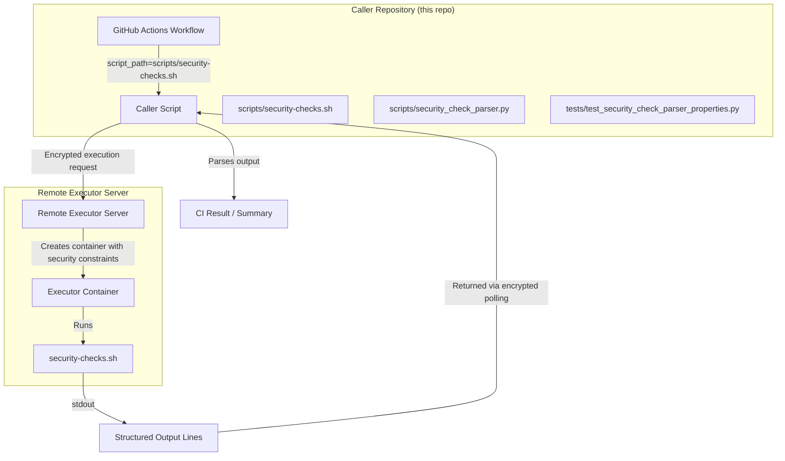

# Design Document: Server Security Test Script

## Overview

This feature adds a bash script (`scripts/security-checks.sh`) to the caller repository that runs inside the Remote Executor's Docker container and verifies that the server's security hardening is correctly applied. The script is submitted through the standard caller workflow (via `script_path` input) and exercises the same execution path as any user script — meaning it validates the real container environment, not a simulated one.

The script performs checks across seven security categories:

1. **Network isolation** — DNS resolution, TCP connectivity, interface enumeration
2. **Filesystem isolation** — read-only root, writable /tmp, read-only /workspace, tmpfs size limits
3. **Capability and privilege** — nobody user, zero capability sets, no-new-privileges, privileged operation denial
4. **Resource limits** — cgroup memory and CPU constraints
5. **Process isolation** — PID namespace, PID 1 identity
6. **Host-level hardening** — host API unreachable, no sensitive environment variables
7. **Attestation isolation** — no NitroTPM device, no attestation binary, no TPM devices, no attestation libraries

Each check produces a structured output line. A summary line and exit code provide an at-a-glance result for CI integration.

On the Python side, a small output parser module enables the caller's test suite to validate the script's output format and summary arithmetic via property-based tests.

## Architecture

The feature has two components:



**Component 1: The bash script** (`scripts/security-checks.sh`) — runs inside the container, performs all checks, writes structured output to stdout.

**Component 2: The output parser** (`scripts/security_check_parser.py`) — a Python module that parses the script's structured output. This enables property-based testing of the output format contract and provides a reusable parser for CI integration.

### Integration with Existing Workflow

The script integrates with the existing caller workflow with zero changes to the workflow file. An operator sets `script_path` to `scripts/security-checks.sh` when dispatching the workflow. The script flows through the same attest → encrypt → execute → poll → verify cycle as any other script. The caller collects stdout and the operator (or a downstream job) inspects the structured output.

## Components and Interfaces

### 1. Security Check Script (`scripts/security-checks.sh`)

**Responsibilities:**
- Execute all security checks in sequence
- Produce structured output to stdout
- Handle missing tools and unexpected errors gracefully
- Exit with code 0 if all checks pass, non-zero otherwise

**Interface (stdout):**
```
SECURITY_HEADER:version=1.0:hostname=<hostname>:date=<ISO-8601>:kernel=<uname-r>
SECURITY_CHECK:<category>:<check_name>:<PASS|FAIL|SKIP|ERROR>:<detail_message>
...
SECURITY_SUMMARY:TOTAL=<n>:PASSED=<p>:FAILED=<f>
```

**Internal structure:**

```bash
#!/usr/bin/env bash
set -uo pipefail
# NOTE: -e is intentionally omitted — the script must continue after
# individual check failures.

SCRIPT_VERSION="1.0"
PASS_COUNT=0
FAIL_COUNT=0
TOTAL_COUNT=0

report_result() {
    local category="$1" check_name="$2" status="$3" detail="$4"
    echo "SECURITY_CHECK:${category}:${check_name}:${status}:${detail}"
    TOTAL_COUNT=$((TOTAL_COUNT + 1))
    case "$status" in
        PASS) PASS_COUNT=$((PASS_COUNT + 1)) ;;
        FAIL) FAIL_COUNT=$((FAIL_COUNT + 1)) ;;
        # SKIP and ERROR don't count toward pass/fail
    esac
}

check_tool() {
    command -v "$1" >/dev/null 2>&1
}
```

Each security category is implemented as a function (e.g., `check_network_isolation`, `check_filesystem_isolation`) that calls `report_result` for each individual check. The script calls all category functions in sequence, then prints the summary and exits.

**Design decisions:**
- `set -e` is **not** used because individual check failures must not abort the script. Each check is independent and the script must continue to the end.
- `set -uo pipefail` is used: `-u` catches undefined variable bugs, `-o pipefail` ensures pipeline failures are detected within individual checks.
- Timeouts on network operations (DNS, TCP) use short values (2-3 seconds) to keep total execution well under the 30-second target.
- The script uses only POSIX-compatible tools likely present in minimal Docker images: `bash`, `cat`, `grep`, `ip`, `id`, `df`, `ls`, `echo`, `timeout` (from coreutils). Missing tools produce SKIP rather than failure.

### 2. Output Parser (`scripts/security_check_parser.py`)

**Responsibilities:**
- Parse SECURITY_CHECK lines from script output
- Parse SECURITY_SUMMARY line
- Parse SECURITY_HEADER line
- Validate format correctness
- Compute expected summary from individual results

**Interface:**

```python
@dataclass
class SecurityCheckResult:
    category: str
    check_name: str
    status: str        # "PASS", "FAIL", "SKIP", "ERROR"
    detail: str

@dataclass
class SecuritySummary:
    total: int
    passed: int
    failed: int

def parse_check_line(line: str) -> SecurityCheckResult | None:
    """Parse a single SECURITY_CHECK line. Returns None if line doesn't match."""

def parse_summary_line(line: str) -> SecuritySummary | None:
    """Parse a SECURITY_SUMMARY line. Returns None if line doesn't match."""

def parse_output(output: str) -> tuple[list[SecurityCheckResult], SecuritySummary | None]:
    """Parse complete script output into results and summary."""

def compute_summary(results: list[SecurityCheckResult]) -> SecuritySummary:
    """Compute expected summary from a list of results."""

def determine_exit_code(results: list[SecurityCheckResult]) -> int:
    """Return 0 if all results are PASS/SKIP/ERROR, 1 if any is FAIL."""
```

**Design decisions:**
- The parser is a separate Python module (not embedded in the test file) so it can be reused by CI tooling or the verify_isolation.py pattern.
- SKIP and ERROR statuses are tracked in TOTAL but not in PASSED or FAILED, matching the bash script's counting logic.

### 3. Security Check Categories — Shell Command Mapping

| Category | Check Name | Shell Command(s) | Pass Condition |
|---|---|---|---|
| network | dns_resolution | `timeout 3 nslookup example.com 2>&1` | Exit code ≠ 0 |
| network | tcp_connection | `timeout 3 bash -c 'echo > /dev/tcp/1.1.1.1/443' 2>&1` | Exit code ≠ 0 |
| network | interfaces | `ip -o link show \| grep -v '^1: lo'` | No output (only lo) |
| filesystem | root_readonly | `touch /root-write-test 2>&1` | Exit code ≠ 0, "Read-only" in stderr |
| filesystem | tmp_writable | `touch /tmp/write-test && rm /tmp/write-test` | Exit code = 0 |
| filesystem | workspace_readonly | `touch /workspace/write-test 2>&1` | Exit code ≠ 0 |
| filesystem | tmp_size_limit | `df -m /tmp \| awk 'NR==2{print $2}'` | Size ≤ 64 MB |
| capabilities | user_nobody | `id -u` | Output = "65534" |
| capabilities | all_caps_zero | `grep -E '^Cap(Inh\|Prm\|Eff\|Bnd\|Amb):' /proc/self/status` | All values = 0000000000000000 |
| capabilities | privileged_op_denied | `chown root /tmp/write-test 2>&1` | Exit code ≠ 0 |
| capabilities | no_new_privs | `grep '^NoNewPrivs:' /proc/self/status \| awk '{print $2}'` | Output = "1" |
| resources | memory_limit | `cat /sys/fs/cgroup/memory.max` (cgroup v2) or `cat /sys/fs/cgroup/memory/memory.limit_in_bytes` (v1) | Value is a finite number (not "max") |
| resources | cpu_limit | `cat /sys/fs/cgroup/cpu.max` (v2) or `cat /sys/fs/cgroup/cpu/cpu.cfs_quota_us` (v1) | Quota is a positive number (not "max" or -1) |
| process | pid_namespace | `ls /proc/ \| grep -E '^[0-9]+$' \| wc -l` | Small count (< 10 processes) |
| process | pid1_entrypoint | `cat /proc/1/cmdline \| tr '\0' ' '` | Contains "bash" |
| host | health_unreachable | `timeout 3 bash -c 'echo > /dev/tcp/172.17.0.1/8080' 2>&1` | Exit code ≠ 0 |
| host | no_sensitive_env | `env \| grep -iE '(GITHUB_TOKEN\|OIDC\|AWS_SECRET\|AWS_ACCESS\|AWS_SESSION)'` | No output |
| attestation | nsm_device_absent | `test -e /dev/nsm` | Exit code ≠ 0 |
| attestation | attest_binary_absent | `which nitro-tpm-attest 2>/dev/null` | Exit code ≠ 0 |
| attestation | nsm_read_fails | `cat /dev/nsm 2>&1` | Exit code ≠ 0 |
| attestation | no_tpm_devices | `ls /dev/ \| grep -iE '(nsm\|tpm\|tpmrm)'` | No output |
| attestation | no_attest_libs | `python3 -c 'import cbor2' 2>&1 && python3 -c 'import wolfcrypt' 2>&1` | Both exit code ≠ 0 |

## Data Models

### Script Output Format

```
SECURITY_HEADER:version=<version>:hostname=<hostname>:date=<ISO-8601>:kernel=<kernel>
SECURITY_CHECK:<category>:<check_name>:<status>:<detail>
SECURITY_SUMMARY:TOTAL=<n>:PASSED=<p>:FAILED=<f>
```

**Field constraints:**
- `category`: lowercase alphanumeric + underscore, e.g., `network`, `filesystem`, `capabilities`, `resources`, `process`, `host`, `attestation`
- `check_name`: lowercase alphanumeric + underscore, e.g., `dns_resolution`, `root_readonly`
- `status`: one of `PASS`, `FAIL`, `SKIP`, `ERROR`
- `detail`: free-form text (no newlines), provides human-readable context
- `TOTAL`: integer, equals count of all SECURITY_CHECK lines
- `PASSED`: integer, equals count of PASS lines
- `FAILED`: integer, equals count of FAIL lines
- Invariant: `TOTAL >= PASSED + FAILED` (SKIP and ERROR contribute to TOTAL but not PASSED or FAILED)

### Python Data Models

```python
@dataclass
class SecurityCheckResult:
    category: str       # e.g., "network"
    check_name: str     # e.g., "dns_resolution"
    status: str         # "PASS" | "FAIL" | "SKIP" | "ERROR"
    detail: str         # Human-readable detail

@dataclass
class SecuritySummary:
    total: int
    passed: int
    failed: int

@dataclass
class SecurityHeader:
    version: str
    hostname: str
    date: str
    kernel: str
```

## Correctness Properties

*A property is a characteristic or behavior that should hold true across all valid executions of a system — essentially, a formal statement about what the system should do. Properties serve as the bridge between human-readable specifications and machine-verifiable correctness guarantees.*

The security checks themselves are integration tests (they verify real container behavior). However, the **output format contract** and **result aggregation logic** are pure functions suitable for property-based testing. The following properties validate the Python parser and the output format invariants.

### Property 1: Output line format round-trip

*For any* valid category name, check name, status (PASS/FAIL/SKIP/ERROR), and detail message (containing no newlines), formatting a SECURITY_CHECK line and then parsing it with `parse_check_line` should produce a `SecurityCheckResult` with identical field values.

**Validates: Requirements 7.1**

### Property 2: Summary arithmetic consistency

*For any* list of `SecurityCheckResult` objects, `compute_summary` should produce a `SecuritySummary` where `total` equals the length of the list, `passed` equals the count of PASS results, `failed` equals the count of FAIL results, and `total >= passed + failed`.

**Validates: Requirements 7.2**

### Property 3: Exit code correctness

*For any* list of `SecurityCheckResult` objects, `determine_exit_code` should return 0 if and only if no result has status FAIL. If any result has status FAIL, the exit code should be non-zero.

**Validates: Requirements 7.3, 7.4**

### Property 4: Summary line format round-trip

*For any* valid total, passed, and failed counts (where `total >= passed + failed` and all are non-negative), formatting a SECURITY_SUMMARY line and then parsing it with `parse_summary_line` should produce a `SecuritySummary` with identical values.

**Validates: Requirements 7.2**

## Error Handling

### Script-Level Error Handling

| Scenario | Behavior |
|---|---|
| Required tool missing (e.g., `ip` not in PATH) | Report `SKIP` for dependent checks, continue to next check |
| Check command fails unexpectedly | Report `ERROR` with captured stderr, continue to next check |
| Check command hangs | `timeout` wrapper kills the command after 3 seconds, report `ERROR` |
| /proc or /sys files unreadable | Report `ERROR` with permission details, continue |
| cgroup interface not found (v1 vs v2) | Try both paths, report `SKIP` if neither exists |

### Parser-Level Error Handling

| Scenario | Behavior |
|---|---|
| Line doesn't match SECURITY_CHECK format | `parse_check_line` returns `None`, line is skipped |
| Summary line missing from output | `parse_output` returns `None` for summary |
| Summary counts don't match individual results | Caller can compare `parse_summary_line` result with `compute_summary` result |
| Empty output | `parse_output` returns empty list and `None` summary |

### Robustness Patterns in the Bash Script

1. **Tool availability check**: Before each check, verify the required tool exists with `command -v`. If missing, report SKIP.
2. **Timeout wrapping**: Network operations and potentially-hanging commands are wrapped with `timeout 3`.
3. **Error capture**: Commands are run with `2>&1` redirection so stderr is captured in the detail message.
4. **No early exit**: `set -e` is intentionally omitted. Each check is independent.
5. **Subshell isolation**: Checks that might affect shell state (e.g., changing directory) run in subshells.

## Testing Strategy

### Integration Tests (Container-Level)

The primary validation of the security checks is running the script inside the actual executor container. This is inherently an integration test — the checks verify real kernel/container behavior. These tests are executed by dispatching the workflow with `script_path=scripts/security-checks.sh`.

**What to verify:**
- All SECURITY_CHECK lines report PASS
- Summary shows zero failures
- Exit code is 0
- Script completes within 30 seconds

### Property-Based Tests (Output Parser)

The output format contract and aggregation logic are tested with Hypothesis property-based tests. These validate the Python parser module against the format specification.

**Library:** Hypothesis (already a dev dependency in `pyproject.toml`)

**Configuration:** Minimum 100 iterations per property test.

**Tag format:** `Feature: server-security-test-script, Property {number}: {property_text}`

**Properties to implement:**
- Property 1: Output line format round-trip
- Property 2: Summary arithmetic consistency
- Property 3: Exit code correctness
- Property 4: Summary line format round-trip

### Unit Tests (Example-Based)

- Header line format validation (contains version, hostname, date, kernel)
- Edge cases: empty output, output with only header, output with no summary
- Parser behavior with malformed lines (extra colons in detail, missing fields)
- SKIP and ERROR status handling in summary computation

### Test File Structure

```
tests/
  test_security_check_parser_properties.py   # Property-based tests (Hypothesis)
  test_security_check_parser_unit.py         # Example-based unit tests
```
